<!-- Source: https://github.com/SuperiorByteWorks-LLC/agent-project | License: Apache-2.0 | Author: Clayton Young / Superior Byte Works, LLC (Boreal Bytes) -->

# Entity Relationship (ER) Diagram

> **Back to [Style Guide](../mermaid_style_guide.md)** — Read the style guide first for emoji, color, and accessibility rules.

**Syntax keyword:** `erDiagram`
**Best for:** Database schemas, data models, entity relationships, API data structures
**When NOT to use:** Class hierarchies with methods (use [Class](class.md)), process flows (use [Flowchart](flowchart.md))

---

## Exemplar Diagram

```mermaid
erDiagram
    accTitle: Project Management Data Model
    accDescr: Entity relationships for a project management system showing teams, projects, tasks, members, and comments with cardinality

    TEAM ||--o{ PROJECT : "owns"
    PROJECT ||--o{ TASK : "contains"
    TASK ||--o{ COMMENT : "has"
    TEAM ||--o{ MEMBER : "includes"
    MEMBER ||--o{ TASK : "assigned to"
    MEMBER ||--o{ COMMENT : "writes"

    TEAM {
        uuid id PK "🔑 Primary key"
        string name "👥 Team name"
        string department "🏢 Department"
    }

    PROJECT {
        uuid id PK "🔑 Primary key"
        uuid team_id FK "🔗 Team reference"
        string title "📋 Project title"
        string status "📊 Current status"
        date deadline "⏰ Due date"
    }

    TASK {
        uuid id PK "🔑 Primary key"
        uuid project_id FK "🔗 Project reference"
        uuid assignee_id FK "👤 Assigned member"
        string title "📝 Task title"
        string priority "⚠️ Priority level"
        string status "📊 Current status"
    }

    MEMBER {
        uuid id PK "🔑 Primary key"
        uuid team_id FK "🔗 Team reference"
        string name "👤 Full name"
        string email "📧 Email address"
        string role "🏷️ Job role"
    }

    COMMENT {
        uuid id PK "🔑 Primary key"
        uuid task_id FK "🔗 Task reference"
        uuid author_id FK "👤 Author reference"
        text body "📝 Comment text"
        timestamp created_at "⏰ Created time"
    }
```

---

## Tips

- Include data types, `PK`/`FK` annotations, and **comment strings** with emoji for context
- Use clear verb-phrase relationship labels: `"owns"`, `"contains"`, `"assigned to"`
- Cardinality notation:
  - `||--o{` one-to-many
  - `||--||` one-to-one
  - `}o--o{` many-to-many
  - `o` = zero or more, `|` = exactly one
- Limit to **5–7 entities** per diagram — split large schemas by domain
- Entity names: `UPPER_CASE` (SQL convention)

---

## Template

```mermaid
erDiagram
    accTitle: Your Title Here
    accDescr: Describe the data model and key relationships between entities

    ENTITY_A ||--o{ ENTITY_B : "has many"
    ENTITY_B ||--|| ENTITY_C : "belongs to"

    ENTITY_A {
        uuid id PK "🔑 Primary key"
        string name "📝 Display name"
    }

    ENTITY_B {
        uuid id PK "🔑 Primary key"
        uuid entity_a_id FK "🔗 Reference"
        string value "📊 Value field"
    }
```

---

## Complex Example

A multi-tenant SaaS platform schema with 10 entities spanning three domains — identity & access, billing & subscriptions, and audit & security. Relationships show the full cardinality picture from tenant isolation through user permissions to invoice generation.

```mermaid
erDiagram
    accTitle: SaaS Multi-Tenant Platform Schema
    accDescr: Ten-entity data model for a multi-tenant SaaS platform covering identity management, role-based access, subscription billing, and audit logging with full cardinality relationships

    TENANT ||--o{ ORGANIZATION : "contains"
    ORGANIZATION ||--o{ USER : "employs"
    ORGANIZATION ||--|| SUBSCRIPTION : "holds"
    USER }o--o{ ROLE : "assigned"
    ROLE ||--o{ PERMISSION : "grants"
    SUBSCRIPTION ||--|| PLAN : "subscribes to"
    SUBSCRIPTION ||--o{ INVOICE : "generates"
    USER ||--o{ AUDIT_LOG : "produces"
    TENANT ||--o{ AUDIT_LOG : "scoped to"
    USER ||--o{ API_KEY : "owns"

    TENANT {
        uuid id PK "🔑 Primary key"
        string name "🏢 Tenant name"
        string subdomain "🌐 Unique subdomain"
        string tier "🏷️ Service tier"
        boolean active "✅ Active status"
        timestamp created_at "⏰ Created time"
    }

    ORGANIZATION {
        uuid id PK "🔑 Primary key"
        uuid tenant_id FK "🔗 Tenant reference"
        string name "👥 Org name"
        string billing_email "📧 Billing contact"
        int seat_count "📊 Licensed seats"
    }

    USER {
        uuid id PK "🔑 Primary key"
        uuid org_id FK "🔗 Organization reference"
        string email "📧 Login email"
        string display_name "👤 Display name"
        string status "📊 Account status"
        timestamp last_login "⏰ Last active"
    }

    ROLE {
        uuid id PK "🔑 Primary key"
        uuid tenant_id FK "🔗 Tenant scope"
        string name "🏷️ Role name"
        string description "📝 Role purpose"
        boolean system_role "🔒 Built-in flag"
    }

    PERMISSION {
        uuid id PK "🔑 Primary key"
        uuid role_id FK "🔗 Role reference"
        string resource "🎯 Target resource"
        string action "⚙️ Allowed action"
        string scope "🔒 Permission scope"
    }

    PLAN {
        uuid id PK "🔑 Primary key"
        string name "🏷️ Plan name"
        int price_cents "💰 Monthly price"
        int seat_limit "👥 Max seats"
        jsonb features "📋 Feature flags"
        boolean active "✅ Available flag"
    }

    SUBSCRIPTION {
        uuid id PK "🔑 Primary key"
        uuid org_id FK "🔗 Organization reference"
        uuid plan_id FK "🔗 Plan reference"
        string status "📊 Sub status"
        date current_period_start "📅 Period start"
        date current_period_end "📅 Period end"
    }

    INVOICE {
        uuid id PK "🔑 Primary key"
        uuid subscription_id FK "🔗 Subscription reference"
        int amount_cents "💰 Total amount"
        string currency "💱 Currency code"
        string status "📊 Payment status"
        timestamp issued_at "⏰ Issue date"
    }

    AUDIT_LOG {
        uuid id PK "🔑 Primary key"
        uuid tenant_id FK "🔗 Tenant scope"
        uuid user_id FK "👤 Acting user"
        string action "⚙️ Action performed"
        string resource_type "🎯 Target type"
        uuid resource_id "🔗 Target ID"
        jsonb metadata "📋 Event details"
        timestamp created_at "⏰ Event time"
    }

    API_KEY {
        uuid id PK "🔑 Primary key"
        uuid user_id FK "👤 Owner"
        string prefix "🏷️ Key prefix"
        string hash "🔐 Hashed secret"
        string name "📝 Key name"
        timestamp expires_at "⏰ Expiration"
        boolean revoked "❌ Revoked flag"
    }
```

### Why this works

- **10 entities organized by domain** — identity (Tenant, Organization, User, Role, Permission), billing (Plan, Subscription, Invoice), and security (Audit Log, API Key). The relationship lines naturally cluster related entities together.
- **Full cardinality tells the business rules** — `||--||` (one-to-one) for Organization-Subscription means one subscription per org. `}o--o{` (many-to-many) for User-Role means flexible RBAC. Each relationship symbol encodes a constraint.
- **Every field has type, annotation, and purpose** — PK/FK for schema generation, emoji comments for human scanning. A developer can read this diagram and write the migration script directly.
