<!-- Source: https://github.com/SuperiorByteWorks-LLC/agent-project | License: Apache-2.0 | Author: Clayton Young / Superior Byte Works, LLC (Boreal Bytes) -->

# Timeline

> **Back to [Style Guide](../mermaid_style_guide.md)** — Read the style guide first for emoji, color, and accessibility rules.

**Syntax keyword:** `timeline`
**Best for:** Chronological events, historical progression, milestones over time, release history
**When NOT to use:** Task durations/dependencies (use [Gantt](gantt.md)), detailed project plans (use [Gantt](gantt.md))

> ⚠️ **Accessibility:** Timelines do **not** support `accTitle`/`accDescr`. Always place a descriptive _italic_ Markdown paragraph directly above the code block.

---

## Exemplar Diagram

_Timeline of a startup's growth milestones from founding through Series A, organized by year and quarter:_

```mermaid
timeline
    title 🚀 Startup Growth Milestones
    section 2024
        Q1 : 💡 Founded : Built MVP
        Q2 : 🧪 Beta launch : 100 users
        Q3 : 📈 Product-market fit : 1K users
        Q4 : 💰 Seed round : $2M raised
    section 2025
        Q1 : 👥 Team of 10 : Hired engineering lead
        Q2 : 🌐 Public launch : 10K users
        Q3 : 🏢 Enterprise tier : First B2B deal
        Q4 : 📊 $1M ARR : Series A prep
    section 2026
        Q1 : 🚀 Series A : $15M raised
```

---

## Tips

- Use `section` to group by year, quarter, or phase
- Each entry can have multiple items separated by `:`
- Keep items concise — 2–4 words each
- Emoji at the start of key items for visual anchoring
- **Always** pair with a Markdown text description above for screen readers

---

## Template

_Description of the timeline and the period it covers:_

```mermaid
timeline
    title 📋 Your Timeline Title
    section Period 1
        Event A : Detail one : Detail two
        Event B : Detail three
    section Period 2
        Event C : Detail four
        Event D : Detail five : Detail six
```

---

## Complex Example

_Multi-year technology platform evolution tracking a startup's journey from monolith through microservices to AI-powered platform. Six sections span 2020-2025, each capturing key technical milestones and business metrics that drove architecture decisions:_

```mermaid
timeline
    title 🚀 Platform Architecture Evolution
    section 2020 — Monolith Era
        Q1 : 💡 Founded company : Rails monolith launched : 10 engineers
        Q3 : ⚠️ Hit scaling ceiling : 50K concurrent users : Database bottleneck
    section 2021 — Breaking Apart
        Q1 : 🔐 Extracted auth service : 🐳 Adopted Docker : CI/CD pipeline live
        Q3 : 📦 Split order processing : ⚡ Added Redis cache : 200K users
    section 2022 — Microservices
        Q1 : ⚙️ 8 services in production : ☸️ Kubernetes migration : Service mesh pilot
        Q3 : 📥 Event-driven architecture : 📊 Observability stack : 500K users
    section 2023 — Platform Maturity
        Q1 : 🌐 Multi-region deployment : 🛡️ Zero-trust networking : 50 engineers
        Q3 : 🔄 Canary deployments : 📈 99.99% uptime SLA : 2M users
    section 2024 — AI Integration
        Q1 : 🧠 ML recommendation engine : ⚡ Real-time personalization
        Q3 : 🔍 AI-powered search : 📊 Predictive analytics : 5M users
    section 2025 — Next Generation
        Q1 : ☁️ Edge computing rollout : 🤖 AI agent platform : 10M users
```

### Why this works

- **6 sections are eras, not just years** — "Monolith Era", "Breaking Apart", "Microservices" tell the story of _why_ the architecture changed, not just _when_
- **Business metrics alongside tech milestones** — user counts and team size appear next to architecture decisions. This shows the _pressure_ that drove each evolution (50K users → scaling ceiling → extracted services)
- **Multiple items per time point** — each quarter packs 2-3 items separated by `:`, giving a dense but scannable view of everything happening in parallel
- **Emoji anchors the scan** — eyes land on 🧠 ML, 🌐 Multi-region, ⚡ Redis before reading the text. For a quick skim, the emoji alone tells the story
