<!-- Source: https://github.com/SuperiorByteWorks-LLC/agent-project | License: Apache-2.0 | Author: Clayton Young / Superior Byte Works, LLC (Boreal Bytes) -->

# Mermaid Diagram Style Guide

> **For AI agents:** Read this file for all core styling rules. Then use the [diagram selection table](#choosing-the-right-diagram) to pick the right type and follow its link — each type has its own file with a production-quality exemplar, tips, and a copy-paste template.
>
> **For humans:** This guide + the linked diagram files ensure every Mermaid diagram in your repo is accessible, professional, and renders cleanly in GitHub light and dark modes. Reference it from your `AGENTS.md` or contributing guide.

**Target platform:** GitHub Markdown (Issues, PRs, Discussions, Wikis, `.md` files)
**Design goal:** Minimal professional styling that renders beautifully in both GitHub light and dark modes, is accessible to screen readers, and communicates clearly with zero visual noise.

---

## Quick Start for Agents

1. **Pick the diagram type** → [Selection table](#choosing-the-right-diagram)
2. **Open that type's file** → Copy the template, fill in your content
3. **Apply styling from this file** → Emoji from [approved set](#approved-emoji-set), colors from [approved palette](#github-compatible-color-classes)
4. **Add accessibility** → `accTitle` + `accDescr` (or italic Markdown paragraph for unsupported types)
5. **Verify** → Renders in light mode, dark mode, and screen reader

---

## Core Principles

| #   | Principle                      | Rule                                                                                                   |
| --- | ------------------------------ | ------------------------------------------------------------------------------------------------------ |
| 1   | **Clarity at every scale**     | Simple diagrams stay flat. Complex ones use subgraphs. Very complex ones split into overview + detail. |
| 2   | **Accessibility always**       | Every diagram gets `accTitle` + `accDescr`. No exceptions.                                             |
| 3   | **Theme neutral**              | No `%%{init}` theme directives. No inline `style`. Let GitHub auto-theme.                              |
| 4   | **Semantic clarity**           | `snake_case` node IDs that match labels. Active voice. Sentence case.                                  |
| 5   | **Consistent styling**         | Same emoji = same meaning everywhere. Same shapes = same semantics.                                    |
| 6   | **Minimal professional flair** | A touch of emoji + strategic bold + optional `classDef` — never more.                                  |

---

## Accessibility Requirements

**Every diagram MUST include both `accTitle` and `accDescr`:**

```
accTitle: Short Name 3-8 Words
accDescr: One or two sentences explaining what this diagram shows and what insight the reader gains from it
```

- `accTitle` — 3–8 words, plain text, names the diagram
- `accDescr` — 1–2 sentences on a **single line** (GitHub limitation), explains purpose and key structure

**Diagram types that do NOT support `accTitle`/`accDescr`:** Mindmap, Timeline, Quadrant, Sankey, XY Chart, Block, Kanban, Packet, Architecture, Radar, Treemap. For these, place a descriptive _italic_ Markdown paragraph directly above the code block as the accessible description.

> **ZenUML note:** ZenUML requires an external plugin and may not render on GitHub. Prefer standard `sequenceDiagram` syntax.

---

## Theme Configuration

### ✅ Do: No theme directive (GitHub auto-detects)

```mermaid
flowchart LR
    accTitle: Secure API Request Flow
    accDescr: Three-step API request from authentication through processing to response

    auth[🔐 Authenticate] --> process[⚙️ Process request] --> respond[📤 Return response]
```



### ❌ Don't: Inline styles or custom themes

```
%% BAD — breaks dark mode
style A fill:#e8f5e9
%%{init: {'theme':'base'}}%%
```

---

## Approved Emoji Set

One emoji per node, at the start of the label. Same emoji = same meaning across all diagrams in a project.

### Systems & Infrastructure

| Emoji | Meaning                           | Example                   |
| ----- | --------------------------------- | ------------------------- |
| ☁️    | Cloud / platform / hosted service | `[☁️ AWS Lambda]`         |
| 🌐    | Network / web / connectivity      | `[🌐 API gateway]`        |
| 🖥️    | Server / compute / machine        | `[🖥️ Application server]` |
| 💾    | Storage / database / persistence  | `[💾 PostgreSQL]`         |
| 🔌    | Integration / plugin / connector  | `[🔌 Webhook handler]`    |

### Processes & Actions

| Emoji | Meaning                          | Example                   |
| ----- | -------------------------------- | ------------------------- |
| ⚙️    | Process / configuration / engine | `[⚙️ Build pipeline]`     |
| 🔄    | Cycle / sync / recurring process | `[🔄 Retry loop]`         |
| 🚀    | Deploy / launch / release        | `[🚀 Ship to production]` |
| ⚡    | Fast action / trigger / event    | `[⚡ Webhook fired]`      |
| 📦    | Package / artifact / bundle      | `[📦 Docker image]`       |
| 🔧    | Tool / utility / maintenance     | `[🔧 Migration script]`   |
| ⏰    | Scheduled / cron / time-based    | `[⏰ Nightly job]`        |

### People & Roles

| Emoji | Meaning                      | Example              |
| ----- | ---------------------------- | -------------------- |
| 👤    | User / person / actor        | `[👤 End user]`      |
| 👥    | Team / group / organization  | `[👥 Platform team]` |
| 🤖    | Bot / agent / automation     | `[🤖 CI bot]`        |
| 🧠    | Intelligence / decision / AI | `[🧠 ML classifier]` |

### Status & Outcomes

| Emoji | Meaning                         | Example                |
| ----- | ------------------------------- | ---------------------- |
| ✅    | Success / approved / complete   | `[✅ Tests passed]`    |
| ❌    | Failure / blocked / rejected    | `[❌ Build failed]`    |
| ⚠️    | Warning / caution / risk        | `[⚠️ Rate limited]`    |
| 🔒    | Locked / restricted / protected | `[🔒 Requires admin]`  |
| 🔐    | Security / encryption / auth    | `[🔐 OAuth handshake]` |

### Information & Data

| Emoji | Meaning                         | Example              |
| ----- | ------------------------------- | -------------------- |
| 📊    | Analytics / metrics / dashboard | `[📊 Usage metrics]` |
| 📋    | Checklist / form / inventory    | `[📋 Requirements]`  |
| 📝    | Document / log / record         | `[📝 Audit trail]`   |
| 📥    | Input / receive / ingest        | `[📥 Event stream]`  |
| 📤    | Output / send / emit            | `[📤 Notification]`  |
| 🔍    | Search / review / inspect       | `[🔍 Code review]`   |
| 🏷️    | Label / tag / version           | `[🏷️ v2.1.0]`        |

### Domain-Specific

| Emoji | Meaning                         | Example                 |
| ----- | ------------------------------- | ----------------------- |
| 💰    | Finance / cost / billing        | `[💰 Invoice]`          |
| 🧪    | Testing / experiment / QA       | `[🧪 A/B test]`         |
| 📚    | Documentation / knowledge base  | `[📚 API docs]`         |
| 🎯    | Goal / target / objective       | `[🎯 OKR tracking]`     |
| 🗂️    | Category / organize / archive   | `[🗂️ Backlog]`          |
| 🔗    | Link / reference / dependency   | `[🔗 External API]`     |
| 🛡️    | Protection / guardrail / policy | `[🛡️ Rate limiter]`     |
| 🏁    | Start / finish / milestone      | `[🏁 Sprint complete]`  |
| ✏️    | Edit / revise / update          | `[✏️ Address feedback]` |
| 🎨    | Design / creative / UI          | `[🎨 Design review]`    |
| 💡    | Idea / insight / inspiration    | `[💡 Feature idea]`     |

### Emoji Rules

1. **Place at start:** `[🔐 Authenticate]` not `[Authenticate 🔐]`
2. **Max one per node** — never stack
3. **Consistency is mandatory** — same emoji = same concept across all diagrams
4. **Not every node needs one** — use on key nodes that benefit from visual distinction
5. **No decorative emoji:** 🎉 💯 🔥 🎊 💥 ✨ — they add noise, not meaning

---

## GitHub-Compatible Color Classes

Use **only** when you genuinely need color-coding (multi-actor diagrams, severity levels). Prefer shapes + emoji first.

**Approved palette (tested in both GitHub light and dark modes):**

| Semantic Use           | `classDef` Definition                                        | Visual                                             |
| ---------------------- | ------------------------------------------------------------ | -------------------------------------------------- |
| **Primary / action**   | `fill:#dbeafe,stroke:#2563eb,stroke-width:2px,color:#1e3a5f` | Light blue fill, blue border, dark navy text       |
| **Success / positive** | `fill:#dcfce7,stroke:#16a34a,stroke-width:2px,color:#14532d` | Light green fill, green border, dark forest text   |
| **Warning / caution**  | `fill:#fef9c3,stroke:#ca8a04,stroke-width:2px,color:#713f12` | Light yellow fill, amber border, dark brown text   |
| **Danger / critical**  | `fill:#fee2e2,stroke:#dc2626,stroke-width:2px,color:#7f1d1d` | Light red fill, red border, dark crimson text      |
| **Neutral / info**     | `fill:#f3f4f6,stroke:#6b7280,stroke-width:2px,color:#1f2937` | Light gray fill, gray border, near-black text      |
| **Accent / highlight** | `fill:#ede9fe,stroke:#7c3aed,stroke-width:2px,color:#3b0764` | Light violet fill, purple border, dark purple text |
| **Warm / commercial**  | `fill:#ffedd5,stroke:#ea580c,stroke-width:2px,color:#7c2d12` | Light peach fill, orange border, dark rust text    |

**Live preview — all 7 classes rendered:**

```mermaid
flowchart LR
    accTitle: Color Palette Preview
    accDescr: Visual reference showing all seven approved classDef color classes side by side

    primary[🔵 Primary] ~~~ success[✅ Success] ~~~ warning[⚠️ Warning] ~~~ danger[❌ Danger]
    neutral[ℹ️ Neutral] ~~~ accent[🟣 Accent] ~~~ warm[🟠 Warm]

    classDef primary fill:#dbeafe,stroke:#2563eb,stroke-width:2px,color:#1e3a5f
    classDef success fill:#dcfce7,stroke:#16a34a,stroke-width:2px,color:#14532d
    classDef warning fill:#fef9c3,stroke:#ca8a04,stroke-width:2px,color:#713f12
    classDef danger fill:#fee2e2,stroke:#dc2626,stroke-width:2px,color:#7f1d1d
    classDef neutral fill:#f3f4f6,stroke:#6b7280,stroke-width:2px,color:#1f2937
    classDef accent fill:#ede9fe,stroke:#7c3aed,stroke-width:2px,color:#3b0764
    classDef warm fill:#ffedd5,stroke:#ea580c,stroke-width:2px,color:#7c2d12

    class primary primary
    class success success
    class warning warning
    class danger danger
    class neutral neutral
    class accent accent
    class warm warm
```



**Rules:**

1. Always include `color:` (text color) — dark-mode backgrounds can hide default text
2. Use `classDef` + `class` — **never** inline `style` directives
3. Max **3–4 color classes** per diagram
4. **Never rely on color alone** — always pair with emoji, shape, or label text

---

## Node Naming & Labels

| Rule                  | ✅ Good                    | ❌ Bad                              |
| --------------------- | -------------------------- | ----------------------------------- | --- | ----- | ----------------------------- | --- |
| `snake_case` IDs      | `run_tests`, `deploy_prod` | `A`, `B`, `node1`                   |
| IDs match labels      | `open_pr` → "Open PR"      | `x` → "Open PR"                     |
| Specific names        | `check_unit_tests`         | `check`                             |
| Verbs for actions     | `run_lint`, `deploy_app`   | `linter`, `deployment`              |
| Nouns for states      | `review_state`, `error`    | `reviewing`, `erroring`             |
| 3–6 word labels       | `[📥 Fetch raw data]`      | `[Raw data is fetched from source]` |
| Active voice          | `[🧪 Run tests]`           | `[Tests are run]`                   |
| Sentence case         | `[Start pipeline]`         | `[Start Pipeline]`                  |
| Edge labels 1–4 words | `-->                       | All green                           |     |`---> | All tests passed successfully |     |

---

## Node Shapes

Use shapes consistently to convey node type without color:

| Shape             | Syntax     | Meaning                      |
| ----------------- | ---------- | ---------------------------- |
| Rounded rectangle | `([text])` | Start / end / terminal       |
| Rectangle         | `[text]`   | Process / action / step      |
| Diamond           | `{text}`   | Decision / condition         |
| Subroutine        | `[[text]]` | Subprocess / grouped action  |
| Cylinder          | `[(text)]` | Database / data store        |
| Asymmetric        | `>text]`   | Event / trigger / external   |
| Hexagon           | `{{text}}` | Preparation / initialization |

---

## Bold Text

Use `**bold**` on **one** key term per node — the word the reader's eye should land on first.

- ✅ `[🚀 **Gradual** rollout]` — highlights the distinguishing word
- ❌ `[**Gradual** **Rollout** **Process**]` — everything bold = nothing bold
- Max 1–2 bold terms per node. Never bold entire labels.

---

## Subgraphs

Subgraphs are the primary tool for organizing complex diagrams. They create visual groupings that help readers parse structure at a glance.

```
subgraph name ["📋 Descriptive Title"]
    node1 --> node2
end
```

**Subgraph rules:**

- Quoted titles with emoji: `["🔍 Code Quality"]`
- Group by stage, domain, team, or layer — whatever creates the clearest mental model
- 2–6 nodes per subgraph is ideal; up to 8 if tightly related
- Subgraphs can connect to each other via edges between their internal nodes
- One level of nesting is acceptable when it genuinely clarifies hierarchy (e.g., a "Backend" subgraph containing "API" and "Workers" subgraphs). Avoid deeper nesting.
- Give every subgraph a meaningful ID and title — `subgraph deploy ["🚀 Deployment"]` not `subgraph sg3`

**Connecting subgraphs — choose the right level of detail:**

Use **subgraph-to-subgraph** edges when the audience needs the high-level flow and internal details would be noise:

```
subgraph build ["📦 Build"]
    compile --> package
end
subgraph deploy ["🚀 Deploy"]
    stage --> prod
end
build --> deploy
```

Use **internal-node-to-internal-node** edges when the audience needs to see exactly which step hands off to which:

```
subgraph build ["📦 Build"]
    compile --> package
end
subgraph deploy ["🚀 Deploy"]
    stage --> prod
end
package --> stage
```

**Pick based on your audience:**

| Audience              | Connect via                   | Why                                |
| --------------------- | ----------------------------- | ---------------------------------- |
| Leadership / overview | Subgraph → subgraph           | They need phases, not steps        |
| Engineers / operators | Internal node → internal node | They need the exact handoff points |
| Mixed / documentation | Both in separate diagrams     | Overview diagram + detail diagram  |

---

## Managing Complexity

Not every diagram is simple, and that's fine. The goal is **clarity at every scale** — a 5-node flowchart and a 30-node system diagram should both be immediately understandable. Use the right strategy for the complexity level.

### Complexity tiers

| Tier             | Node count  | Strategy                                                                                                                                                   |
| ---------------- | ----------- | ---------------------------------------------------------------------------------------------------------------------------------------------------------- |
| **Simple**       | 1–10 nodes  | Flat diagram, no subgraphs needed                                                                                                                          |
| **Moderate**     | 10–20 nodes | **Use subgraphs** to group related nodes into 2–4 logical clusters                                                                                         |
| **Complex**      | 20–30 nodes | **Subgraphs are mandatory.** 3–6 subgraphs, each with a clear title and purpose. Consider whether an overview + detail approach would be clearer.          |
| **Very complex** | 30+ nodes   | **Split into multiple diagrams.** Create an overview diagram showing subgraph-level relationships, then a detail diagram per subgraph. Link them in prose. |

### When to use subgraphs vs. split into multiple diagrams

**Use subgraphs when:**

- The connections _between_ groups are essential to understanding (splitting would lose that)
- A reader needs to see the full picture in one place (e.g., deployment pipeline, request lifecycle)
- Each group has 2–6 nodes and there are 3–5 groups total

**Split into multiple diagrams when:**

- Groups are mostly independent (few cross-group connections)
- The single diagram would exceed ~30 nodes even with subgraphs
- Different audiences need different views (overview for leadership, detail for engineers)
- The diagram is too wide/tall to read without scrolling

**Use overview + detail pattern when:**

- You need both the big picture AND the details
- The overview shows subgraph-level blocks with key connections
- Each detail diagram zooms into one subgraph with full internal structure
- Link them: _"See [Managing complexity](#managing-complexity) for the full scaling guidance."_

### Best practices at any scale

- **One primary flow direction** per diagram — `TB` for hierarchies/processes, `LR` for pipelines/timelines. Mixed directions confuse readers.
- **Decision points** — keep to ≤3 per subgraph. If a single subgraph has 4+ decisions, it deserves its own focused diagram.
- **Edge crossings** — minimize by grouping tightly-connected nodes together. If edges are crossing multiple subgraphs chaotically, reorganize the groupings.
- **Labels stay concise** regardless of diagram size — 3–6 words per node, 1–4 words per edge. Complexity comes from structure, not verbose labels.
- **Color-code subgraph purpose** — in complex diagrams, use `classDef` classes to visually distinguish layers (e.g., all "data" nodes in one color, all "API" nodes in another). Max 3–4 classes even in large diagrams.

### Composing multiple diagrams

When a single diagram isn't enough — multiple audiences, overview + detail needs, or before/after migration docs — see **[Composing Complex Diagram Sets](mermaid_diagrams/complex_examples.md)** for patterns and production-quality examples showing how to combine flowcharts, sequences, ER diagrams, and more into cohesive documentation.

---

## Choosing the Right Diagram

Read the "best for" column, then follow the link to the type file for the exemplar diagram, tips, and template.

| You want to show...                      | Type             | File                                                |
| ---------------------------------------- | ---------------- | --------------------------------------------------- |
| Steps in a process / decisions           | **Flowchart**    | [flowchart.md](mermaid_diagrams/flowchart.md)       |
| Who talks to whom, when                  | **Sequence**     | [sequence.md](mermaid_diagrams/sequence.md)         |
| Class hierarchy / type relationships     | **Class**        | [class.md](mermaid_diagrams/class.md)               |
| Status transitions / lifecycle           | **State**        | [state.md](mermaid_diagrams/state.md)               |
| Database schema / data model             | **ER**           | [er.md](mermaid_diagrams/er.md)                     |
| Project timeline / roadmap               | **Gantt**        | [gantt.md](mermaid_diagrams/gantt.md)               |
| Parts of a whole (proportions)           | **Pie**          | [pie.md](mermaid_diagrams/pie.md)                   |
| Git branching / merge strategy           | **Git Graph**    | [git_graph.md](mermaid_diagrams/git_graph.md)       |
| Concept hierarchy / brainstorm           | **Mindmap**      | [mindmap.md](mermaid_diagrams/mindmap.md)           |
| Events over time (chronological)         | **Timeline**     | [timeline.md](mermaid_diagrams/timeline.md)         |
| User experience / satisfaction map       | **User Journey** | [user_journey.md](mermaid_diagrams/user_journey.md) |
| Two-axis prioritization / comparison     | **Quadrant**     | [quadrant.md](mermaid_diagrams/quadrant.md)         |
| Requirements traceability                | **Requirement**  | [requirement.md](mermaid_diagrams/requirement.md)   |
| System architecture (zoom levels)        | **C4**           | [c4.md](mermaid_diagrams/c4.md)                     |
| Flow magnitude / resource distribution   | **Sankey**       | [sankey.md](mermaid_diagrams/sankey.md)             |
| Numeric trends (bar + line charts)       | **XY Chart**     | [xy_chart.md](mermaid_diagrams/xy_chart.md)         |
| Component layout / spatial arrangement   | **Block**        | [block.md](mermaid_diagrams/block.md)               |
| Work item status board                   | **Kanban**       | [kanban.md](mermaid_diagrams/kanban.md)             |
| Binary protocol / data format            | **Packet**       | [packet.md](mermaid_diagrams/packet.md)             |
| Infrastructure topology                  | **Architecture** | [architecture.md](mermaid_diagrams/architecture.md) |
| Multi-dimensional comparison / skills    | **Radar**        | [radar.md](mermaid_diagrams/radar.md)               |
| Hierarchical proportions / budget        | **Treemap**      | [treemap.md](mermaid_diagrams/treemap.md)           |
| Code-style sequence (programming syntax) | **ZenUML**       | [zenuml.md](mermaid_diagrams/zenuml.md)             |

**Pick the most specific type.** Don't default to flowcharts — match your content to the diagram type that was designed for it. A sequence diagram communicates service interactions better than a flowchart ever will.

---

## Known Parser Gotchas

These will save you debugging time:

| Diagram Type     | Gotcha                                          | Fix                                                                 |
| ---------------- | ----------------------------------------------- | ------------------------------------------------------------------- |
| **Architecture** | Emoji in `[]` labels causes parse errors        | Use plain text labels only                                          |
| **Architecture** | Hyphens in `[]` labels parsed as edge operators | `[US East Region]` not `[US-East Region]`                           |
| **Architecture** | `-->` arrow syntax is strict about spacing      | Use `lb:R --> L:api` format exactly                                 |
| **Requirement**  | `id` field with dashes (`REQ-001`) can fail     | Use numeric IDs: `id: 1`                                            |
| **Requirement**  | Capitalized risk/verify values can fail         | Use lowercase: `risk: high`, `verifymethod: test`                   |
| **C4**           | Long descriptions cause label overlaps          | Keep descriptions under 4 words; use `UpdateRelStyle()` for offsets |
| **C4**           | Emoji in labels render but look odd             | Skip emoji in C4 — renderer has its own icons                       |
| **Flowchart**    | The word `end` breaks parsing                   | Wrap in quotes: `["End"]` or use `end_node` as ID                   |
| **Sankey**       | No emoji in node names                          | Parser doesn't support them — use plain text                        |
| **ZenUML**       | Requires external plugin                        | May not render on GitHub — prefer `sequenceDiagram`                 |
| **Treemap**      | Very new (v11.12.0+)                            | Verify GitHub supports it before using                              |
| **Radar**        | Requires v11.6.0+                               | Verify GitHub supports it before using                              |

---

## Quality Checklist

### Every Diagram

- [ ] `accTitle` + `accDescr` present (or italic Markdown paragraph for unsupported types)
- [ ] Complexity managed: ≤10 nodes flat, 10–30 with subgraphs, 30+ split into multiple diagrams
- [ ] Subgraphs used if >10 nodes (grouped by stage, domain, team, or layer)
- [ ] ≤3 decision points per subgraph
- [ ] Semantic `snake_case` IDs
- [ ] Labels: 3–6 words, active voice, sentence case
- [ ] Edge labels: 1–4 words
- [ ] Consistent shapes for consistent meanings
- [ ] Single primary flow direction (`TB` or `LR`)
- [ ] No inline `style` directives
- [ ] Minimal edge crossings (reorganize groupings if chaotic)

### If Using Color/Emoji/Bold

- [ ] Colors from approved palette using `classDef` + `class`
- [ ] Text `color:` included in every `classDef`
- [ ] ≤4 color classes
- [ ] Emoji from approved set, max 1 per node
- [ ] Bold on max 1–2 words per node
- [ ] Meaning never conveyed by color alone

### Before Merge

- [ ] Renders in GitHub **light** mode
- [ ] Renders in GitHub **dark** mode
- [ ] Emoji meanings consistent across all diagrams in the document

---

## Testing

1. **GitHub:** Push to branch → toggle Profile → Settings → Appearance → Theme
2. **VS Code:** "Markdown Preview Mermaid Support" extension → `Cmd/Ctrl + Shift + V`
3. **Live editor:** [mermaid.live](https://mermaid.live/) — paste and toggle themes
4. **Screen reader:** Verify `accTitle`/`accDescr` announced (VoiceOver, NVDA, JAWS)

---

## Resources

- [Markdown Style Guide](markdown_style_guide.md) — Formatting, citations, and document structure for the markdown that wraps your diagrams
- [Mermaid Docs](https://mermaid.js.org/) · [Live Editor](https://mermaid.live/) · [Accessibility](https://mermaid.js.org/config/accessibility.html) · [GitHub Support](https://github.blog/2022-02-14-include-diagrams-markdown-files-mermaid/) · [VS Code Extension](https://marketplace.visualstudio.com/items?itemName=vstirbu.vscode-mermaid-preview)
