<!-- Source: https://github.com/SuperiorByteWorks-LLC/agent-project | License: Apache-2.0 | Author: Clayton Young / Superior Byte Works, LLC (Boreal Bytes) -->

# Flowchart

> **Back to [Style Guide](../mermaid_style_guide.md)** — Read the style guide first for emoji, color, and accessibility rules.

**Syntax keyword:** `flowchart`
**Best for:** Sequential processes, workflows, decision logic, troubleshooting trees
**When NOT to use:** Complex timing between actors (use [Sequence](sequence.md)), state machines (use [State](state.md))

---

## Exemplar Diagram

```mermaid
flowchart TB
    accTitle: Feature Development Lifecycle
    accDescr: End-to-end feature flow from idea through design, build, test, review, and release with a revision loop on failed reviews

    idea([💡 Feature idea]) --> spec[📋 Write spec]
    spec --> design[🎨 Design solution]
    design --> build[🔧 Implement]
    build --> test[🧪 Run tests]
    test --> review{🔍 Review passed?}
    review -->|Yes| release[🚀 Release to prod]
    review -->|No| revise[✏️ Revise code]
    revise --> test
    release --> monitor([📊 Monitor metrics])

    classDef start fill:#ede9fe,stroke:#7c3aed,stroke-width:2px,color:#3b0764
    classDef process fill:#dbeafe,stroke:#2563eb,stroke-width:2px,color:#1e3a5f
    classDef decision fill:#fef9c3,stroke:#ca8a04,stroke-width:2px,color:#713f12
    classDef success fill:#dcfce7,stroke:#16a34a,stroke-width:2px,color:#14532d

    class idea,monitor start
    class spec,design,build,test,revise process
    class review decision
    class release success
```

---

## Tips

- Use `TB` (top-to-bottom) for processes, `LR` (left-to-right) for pipelines
- Rounded rectangles `([text])` for start/end, diamonds `{text}` for decisions
- Max 10 nodes — split larger flows into "Phase 1" / "Phase 2" diagrams
- Max 3 decision points per diagram
- Edge labels should be 1–4 words: `-->|Yes|`, `-->|All green|`
- Use `classDef` for **semantic** coloring — decisions in amber, success in green, actions in blue

## Subgraph Pattern

When you need grouped stages:

```mermaid
flowchart TB
    accTitle: CI/CD Pipeline Stages
    accDescr: Three-stage pipeline grouping code quality checks, testing, and deployment into distinct phases

    trigger([⚡ Push to main])

    subgraph quality ["🔍 Code Quality"]
        lint[📝 Lint code] --> format[⚙️ Check formatting]
    end

    subgraph testing ["🧪 Testing"]
        unit[🧪 Unit tests] --> integration[🔗 Integration tests]
    end

    subgraph deploy ["🚀 Deployment"]
        build[📦 Build artifacts] --> ship[☁️ Deploy to staging]
    end

    trigger --> quality
    quality --> testing
    testing --> deploy
    deploy --> done([✅ Pipeline complete])

    classDef trigger_style fill:#ede9fe,stroke:#7c3aed,stroke-width:2px,color:#3b0764
    classDef success fill:#dcfce7,stroke:#16a34a,stroke-width:2px,color:#14532d

    class trigger trigger_style
    class done success
```

---

## Template

```mermaid
flowchart TB
    accTitle: Your Title Here (3-8 words)
    accDescr: One or two sentences explaining what this diagram shows and what insight the reader gains

    start([🏁 Starting point]) --> step1[⚙️ First action]
    step1 --> decision{🔍 Check condition?}
    decision -->|Yes| step2[✅ Positive path]
    decision -->|No| step3[🔧 Alternative path]
    step2 --> done([🏁 Complete])
    step3 --> done
```

---

## Complex Example

A 20+ node e-commerce order pipeline organized into 5 subgraphs, each representing a processing phase. Subgraphs connect through internal nodes, decision points route orders to exception handling, and color classes distinguish phases at a glance.

```mermaid
flowchart TB
    accTitle: E-Commerce Order Processing Pipeline
    accDescr: Full order lifecycle from intake through fulfillment, shipping, and notification with exception handling paths for payment failures, stockouts, and delivery issues

    order_in([📥 New order]) --> validate_pay{💰 Payment valid?}

    subgraph intake ["📥 Order Intake"]
        validate_pay -->|Yes| check_fraud{🔐 Fraud check}
        validate_pay -->|No| pay_fail[❌ Payment **declined**]
        check_fraud -->|Clear| check_stock{📦 In stock?}
        check_fraud -->|Flagged| manual_review[🔍 Manual **review**]
        manual_review --> check_stock
    end

    subgraph fulfill ["📦 Fulfillment"]
        pick[📋 **Pick** items] --> pack[📦 Pack order]
        pack --> label[🏷️ Generate **shipping** label]
    end

    subgraph ship ["🚚 Shipping"]
        handoff[🚚 Carrier **handoff**] --> transit[📍 In transit]
        transit --> deliver{✅ Delivered?}
    end

    subgraph notify ["📤 Notifications"]
        confirm_email[📧 Order **confirmed**]
        ship_update[📧 Shipping **update**]
        deliver_email[📧 Delivery **confirmed**]
    end

    subgraph exception ["⚠️ Exception Handling"]
        pay_fail --> retry_pay[🔄 Retry payment]
        retry_pay --> validate_pay
        out_of_stock[📦 **Backorder** created]
        deliver_fail[🔄 **Reattempt** delivery]
    end

    check_stock -->|Yes| pick
    check_stock -->|No| out_of_stock
    label --> handoff
    deliver -->|Yes| deliver_email
    deliver -->|No| deliver_fail
    deliver_fail --> transit

    check_stock -->|Yes| confirm_email
    handoff --> ship_update
    deliver_email --> complete([✅ Order **complete**])

    classDef intake_style fill:#dbeafe,stroke:#2563eb,stroke-width:2px,color:#1e3a5f
    classDef fulfill_style fill:#ede9fe,stroke:#7c3aed,stroke-width:2px,color:#3b0764
    classDef ship_style fill:#dcfce7,stroke:#16a34a,stroke-width:2px,color:#14532d
    classDef warn_style fill:#fef9c3,stroke:#ca8a04,stroke-width:2px,color:#713f12
    classDef danger_style fill:#fee2e2,stroke:#dc2626,stroke-width:2px,color:#7f1d1d

    class validate_pay,check_fraud,check_stock,manual_review intake_style
    class pick,pack,label fulfill_style
    class handoff,transit,deliver ship_style
    class confirm_email,ship_update,deliver_email warn_style
    class pay_fail,retry_pay,out_of_stock,deliver_fail danger_style
```

### Why this works

- **5 subgraphs map to real business phases** — intake, fulfillment, shipping, notification, and exceptions are how operations teams actually think about orders
- **Exception handling is its own subgraph** — not scattered across phases. Agents and readers can see all failure paths in one place
- **Color classes reinforce structure** — blue for intake, purple for fulfillment, green for shipping, amber for notifications, red for exceptions. Even without reading labels, the color pattern tells you which phase you're looking at
- **Decisions route between subgraphs** — the diamonds (`{Payment valid?}`, `{In stock?}`, `{Delivered?}`) are the points where flow branches, and each branch leads to a clearly-labeled destination
