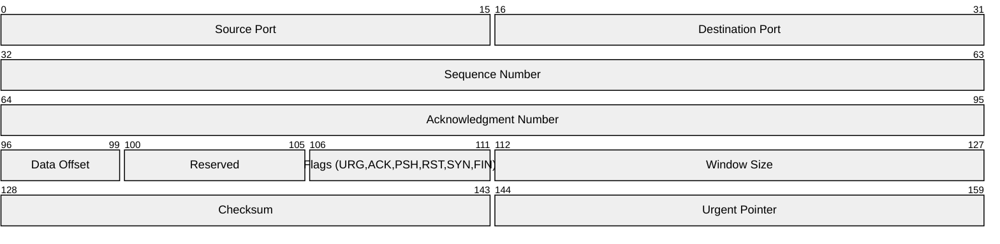
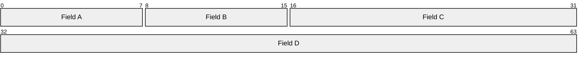

<!-- Source: https://github.com/SuperiorByteWorks-LLC/agent-project | License: Apache-2.0 | Author: Clayton Young / Superior Byte Works, LLC (Boreal Bytes) -->

# Packet Diagram

> **Back to [Style Guide](../mermaid_style_guide.md)** — Read the style guide first for emoji, color, and accessibility rules.

**Syntax keyword:** `packet-beta`
**Best for:** Network protocol headers, data structure layouts, binary format documentation, bit-level specifications
**When NOT to use:** General data models (use [ER](er.md)), system architecture (use [C4](c4.md) or [Architecture](architecture.md))

> ⚠️ **Accessibility:** Packet diagrams do **not** support `accTitle`/`accDescr`. Always place a descriptive _italic_ Markdown paragraph directly above the code block.

---

## Exemplar Diagram

_Packet diagram showing the structure of a simplified TCP header with field sizes in bits:_

---

## Tips

- Ranges are `start-end:` in bits (0-indexed)
- Keep field labels concise — abbreviate if needed
- Use for any fixed-width binary format, not just network packets
- Row width defaults to 32 bits — fields wrap naturally
- **Always** pair with a Markdown text description above for screen readers

---

## Template

_Description of the protocol or data format and its field structure:_

