# CRISPR-Based Gene Editing Efficiency Analysis

_Example research report — demonstrates markdown-mermaid-writing skill standards. All diagrams use Mermaid embedded in markdown as the source format._

---

## 📋 Overview

This report analyzes the efficiency of CRISPR-Cas9 gene editing across three cell line models under variable guide RNA (gRNA) conditions. Editing efficiency was quantified by T7E1 assay and next-generation sequencing (NGS) of on-target loci[^1].

**Key findings:**

- HEK293T cells show highest editing efficiency (mean 78%) across all gRNA designs
- GC content between 40–65% correlates with editing efficiency (r = 0.82)
- Off-target events occur at <0.1% frequency across all conditions tested

---

## 🔄 Experimental workflow

CRISPR editing experiments followed a standardized five-stage protocol. Each stage has defined go/no-go criteria before proceeding.

```mermaid
flowchart TD
    accTitle: CRISPR Editing Experimental Workflow
    accDescr: Five-stage experimental pipeline from gRNA design through data analysis, with quality checkpoints between each stage.

    design["🧬 Stage 1<br/>gRNA Design<br/>(CRISPRscan + Cas-OFFinder)"]
    synth["⚙️ Stage 2<br/>Oligo Synthesis<br/>& Annealing"]
    transfect["🔬 Stage 3<br/>Cell Transfection<br/>(Lipofectamine 3000)"]
    screen["🧪 Stage 4<br/>Primary Screen<br/>(T7E1 assay)"]
    ngs["📊 Stage 5<br/>NGS Validation<br/>(150 bp PE reads)"]

    qc1{GC 40-65%?}
    qc2{Yield ≥ 2 µg?}
    qc3{Viability ≥ 85%?}
    qc4{Band visible?}

    design --> qc1
    qc1 -->|"✅ Pass"| synth
    qc1 -->|"❌ Redesign"| design
    synth --> qc2
    qc2 -->|"✅ Pass"| transfect
    qc2 -->|"❌ Re-synthesize"| synth
    transfect --> qc3
    qc3 -->|"✅ Pass"| screen
    qc3 -->|"❌ Optimize"| transfect
    screen --> qc4
    qc4 -->|"✅ Pass"| ngs
    qc4 -->|"❌ Repeat"| screen

    classDef stage fill:#dbeafe,stroke:#2563eb,stroke-width:2px,color:#1e3a5f
    classDef gate fill:#fef9c3,stroke:#ca8a04,stroke-width:2px,color:#713f12
    classDef fail fill:#fee2e2,stroke:#dc2626,stroke-width:2px,color:#7f1d1d

    class design,synth,transfect,screen,ngs stage
    class qc1,qc2,qc3,qc4 gate
```

---

## 🔬 Methods

### Cell lines and culture

Three cell lines were used: HEK293T (human embryonic kidney), K562 (chronic myelogenous leukemia), and Jurkat (T-lymphocyte). All lines were maintained in RPMI-1640 with 10% FBS at 37°C / 5% CO₂[^2].

### gRNA design and efficiency prediction

gRNAs targeting the _EMX1_ locus were designed using CRISPRscan[^3] with the following criteria:

| Criterion | Threshold | Rationale |
| -------------------- | --------- | ------------------------------------- |
| GC content | 40–65% | Optimal Tm and Cas9 binding |
| CRISPRscan score | ≥ 0.6 | Predicted on-target activity |
| Off-target sites | ≤ 5 (≤3 mismatches) | Reduce off-target editing risk |
| Homopolymer runs | None (>4 nt) | Prevents premature transcription stop |

### Transfection protocol

RNP complexes were assembled at 1:1.2 molar ratio (Cas9:gRNA) and delivered by lipofection. Cells were harvested 72 hours post-transfection for genomic DNA extraction.

### Analysis pipeline

```mermaid
sequenceDiagram
    accTitle: NGS Data Analysis Pipeline
    accDescr: Sequence of computational steps from raw FASTQ files through variant calling to final efficiency report.

    participant raw as 📥 Raw FASTQ
    participant qc as 🔍 FastQC
    participant trim as ✂️ Trimmomatic
    participant align as 🗺️ BWA-MEM2
    participant call as ⚙️ CRISPResso2
    participant report as 📊 Report

    raw->>qc: Per-base quality scores
    qc-->>trim: Flag low-Q reads (Q<20)
    trim->>align: Cleaned reads
    align->>align: Index reference genome (hg38)
    align->>call: BAM + target region BED
    call->>call: Quantify indel frequency
    call-->>report: Editing efficiency (%)
    call-->>report: Off-target events
    report-->>report: Statistical summary
```

---

## 📊 Results

### Editing efficiency by cell line

| Cell line | n (replicates) | Mean efficiency (%) | SD (%) | Range (%) |
| ---------- | -------------- | ------------------- | ------ | --------- |
| **HEK293T** | 6 | **78.4** | 4.2 | 71.2–84.6 |
| K562 | 6 | 52.1 | 8.7 | 38.4–63.2 |
| Jurkat | 6 | 31.8 | 11.3 | 14.2–47.5 |

HEK293T cells showed significantly higher editing efficiency than both K562 (p < 0.001) and Jurkat (p < 0.001) lines by one-way ANOVA with Tukey post-hoc correction.

### Effect of GC content on efficiency

GC content between 40–65% was strongly correlated with editing efficiency (Pearson r = 0.82, p < 0.0001, n = 48 gRNAs).

```mermaid
xychart-beta
    accTitle: Editing Efficiency vs gRNA GC Content
    accDescr: Bar chart showing mean editing efficiency grouped by GC content bins, demonstrating optimal performance in the 40 to 65 percent GC range

    title "Mean Editing Efficiency by GC Content Bin (HEK293T)"
    x-axis ["< 30%", "30–40%", "40–50%", "50–65%", "> 65%"]
    y-axis "Editing Efficiency (%)" 0 --> 100
    bar [18, 42, 76, 81, 38]
```

### Timeline of key experimental milestones

```mermaid
timeline
    accTitle: Experiment Timeline — CRISPR Efficiency Study
    accDescr: Chronological milestones from study design through manuscript submission across six months

    section Month 1
        Study design and gRNA library design : 48 gRNAs across 3 target loci
        Cell line authentication : STR profiling confirmed all three lines
    section Month 2
        gRNA synthesis and QC : 46/48 gRNAs passed yield threshold
        Pilot transfections (HEK293T) : Optimized lipofection conditions
    section Month 3
        Full transfection series : All 3 cell lines, all 46 gRNAs, 6 replicates
        T7E1 primary screening : Passed go/no-go for all conditions
    section Month 4
        NGS library preparation : 276 samples processed
        Sequencing run (NovaSeq) : 150 bp PE, mean 50k reads/sample
    section Month 5
        Bioinformatic analysis : CRISPResso2 pipeline
        Statistical analysis : ANOVA, correlation, regression
    section Month 6
        Manuscript preparation : This report
```

---

## 🔍 Discussion

### Why HEK293T outperforms suspension lines

HEK293T's superior editing efficiency relative to K562 and Jurkat likely reflects three factors[^4]:

1. **Adherent morphology** — enables more uniform lipofection contact
2. **High transfection permissiveness** — HEK293T expresses the SV40 large T antigen, which may facilitate nuclear import
3. **Cell cycle distribution** — higher proportion in S/G2 phase where HDR is favored

<strong>🔧 Technical details — off-target analysis</strong>

Off-target editing was assessed by GUIDE-seq at the 5 highest-activity gRNAs. No off-target sites exceeding 0.1% editing frequency were detected. The three potential sites flagged by Cas-OFFinder (≤2 mismatches) showed 0.00%, 0.02%, and 0.04% indel frequencies — all below the assay noise floor of 0.05%.

Full GUIDE-seq data available in supplementary data package (GEO accession pending).

---

### Comparison with published benchmarks

_Radar chart comparing three CRISPR delivery methods across five performance dimensions. Note: Radar charts do not support `accTitle`/`accDescr` — description provided above._

---

## 🎯 Conclusions

1. RNP-lipofection in HEK293T achieves >75% CRISPR editing efficiency — competitive with electroporation without the associated viability cost
2. gRNA GC content is the single strongest predictor of editing efficiency in our dataset (r = 0.82)
3. This protocol is not directly transferable to suspension lines without further optimization; K562 and Jurkat require electroporation or viral delivery for comparable efficiency

---

## 🔗 References

[^1]: Ran, F.A. et al. (2013). "Genome engineering using the CRISPR-Cas9 system." _Nature Protocols_, 8(11), 2281–2308. https://doi.org/10.1038/nprot.2013.143

[^2]: ATCC. (2024). "Cell Line Authentication and Quality Control." https://www.atcc.org/resources/technical-documents/cell-line-authentication

[^3]: Moreno-Mateos, M.A. et al. (2015). "CRISPRscan: designing highly efficient sgRNAs for CRISPR-Cas9 targeting in vivo." _Nature Methods_, 12(10), 982–988. https://doi.org/10.1038/nmeth.3543

[^4]: Molla, K.A. & Yang, Y. (2019). "CRISPR/Cas-Mediated Base Editing: Technical Considerations and Practical Applications." _Trends in Biotechnology_, 37(10), 1121–1142. https://doi.org/10.1016/j.tibtech.2019.03.008
