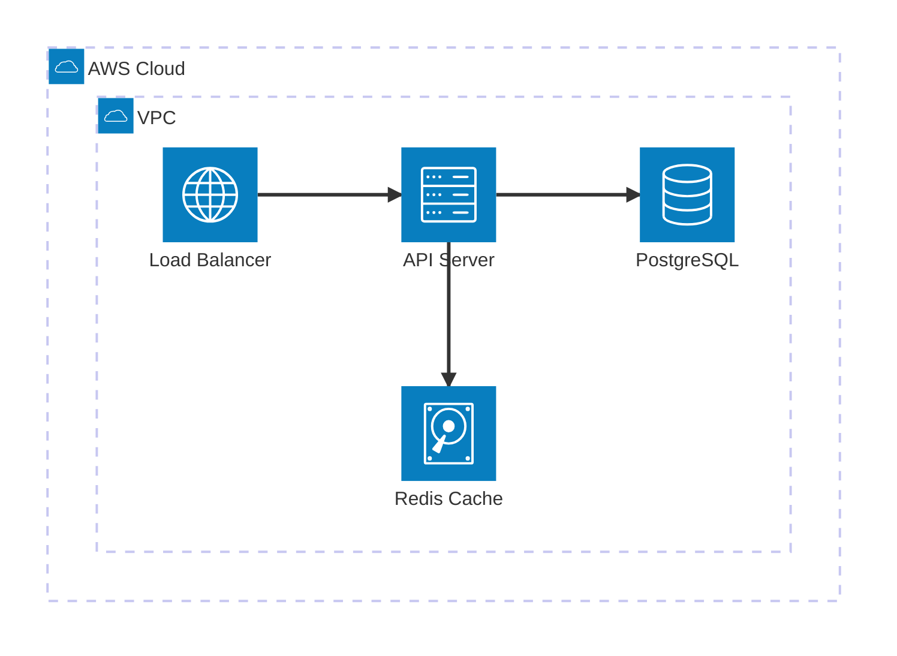
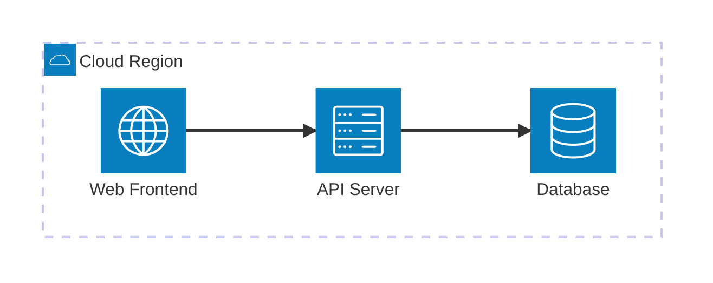
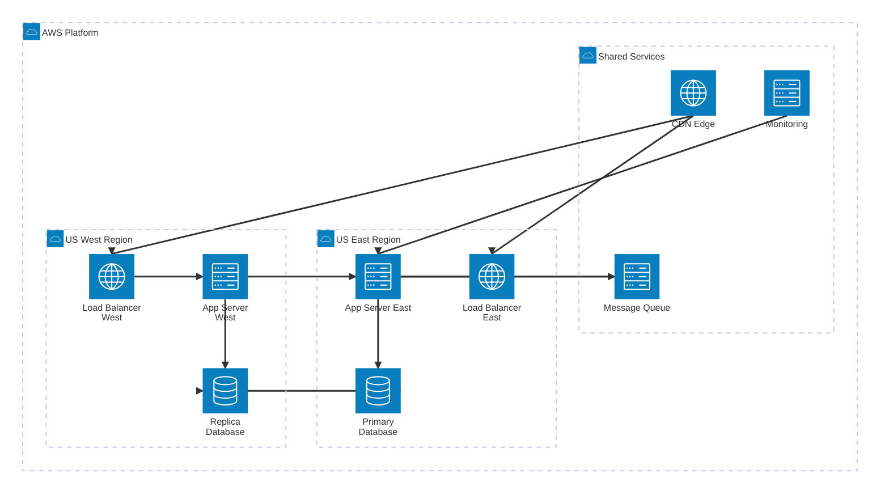

<!-- Source: https://github.com/SuperiorByteWorks-LLC/agent-project | License: Apache-2.0 | Author: Clayton Young / Superior Byte Works, LLC (Boreal Bytes) -->

# Architecture Diagram

> **Back to [Style Guide](../mermaid_style_guide.md)** — Read the style guide first for emoji, color, and accessibility rules.

**Syntax keyword:** `architecture-beta`
**Best for:** Cloud infrastructure, service topology, deployment architecture, network layout
**When NOT to use:** Logical system boundaries (use [C4](c4.md)), component layout without cloud semantics (use [Block](block.md))

> ⚠️ **Accessibility:** Architecture diagrams do **not** support `accTitle`/`accDescr`. Always place a descriptive _italic_ Markdown paragraph directly above the code block.

---

## Exemplar Diagram

_Architecture diagram showing a cloud-hosted web application with a load balancer, API server, database, and cache deployed within a VPC:_

---

## Tips

- Use `group` for logical boundaries (VPC, region, cluster, availability zone)
- Use `service` for individual components
- Direction annotations on connections: `:L` (left), `:R` (right), `:T` (top), `:B` (bottom)
- Built-in icon types: `cloud`, `server`, `database`, `internet`, `disk`
- Nest groups with `in parent_group`
- **Labels must be plain text** — no emoji and no hyphens in `[]` labels (parser treats `-` as an edge operator)
- Use `-->` for directional arrows, `--` for undirected edges
- Keep to **6–8 services** per diagram
- **Always** pair with a Markdown text description above for screen readers

---

## Template

_Description of the infrastructure topology and key components:_

---

## Complex Example

_Multi-region cloud deployment with 3 nested groups (2 regional clusters + shared services) showing 9 services, cross-region database replication, CDN distribution, and centralized monitoring. Demonstrates how nested `group` + `in` syntax creates clear infrastructure boundaries:_

### Why this works

- **Nested groups mirror real infrastructure** — cloud > region > services is exactly how teams think about multi-region deployments. The nesting creates clear blast radius boundaries.
- **Plain text labels only** — architecture diagrams parse-fail with emoji in `[]` labels. All visual distinction comes from the group nesting and icon types (`internet`, `server`, `database`).
- **Directional annotations prevent overlap** — `:B --> T:` (bottom-to-top), `:R --> L:` (right-to-left) control where edges connect. Without these, Mermaid stacks edges on top of each other.
- **Cross-region replication is explicit** — the `db_primary:R --> L:db_replica` edge is the most important infrastructure detail and reads clearly as a horizontal connection between regions.
