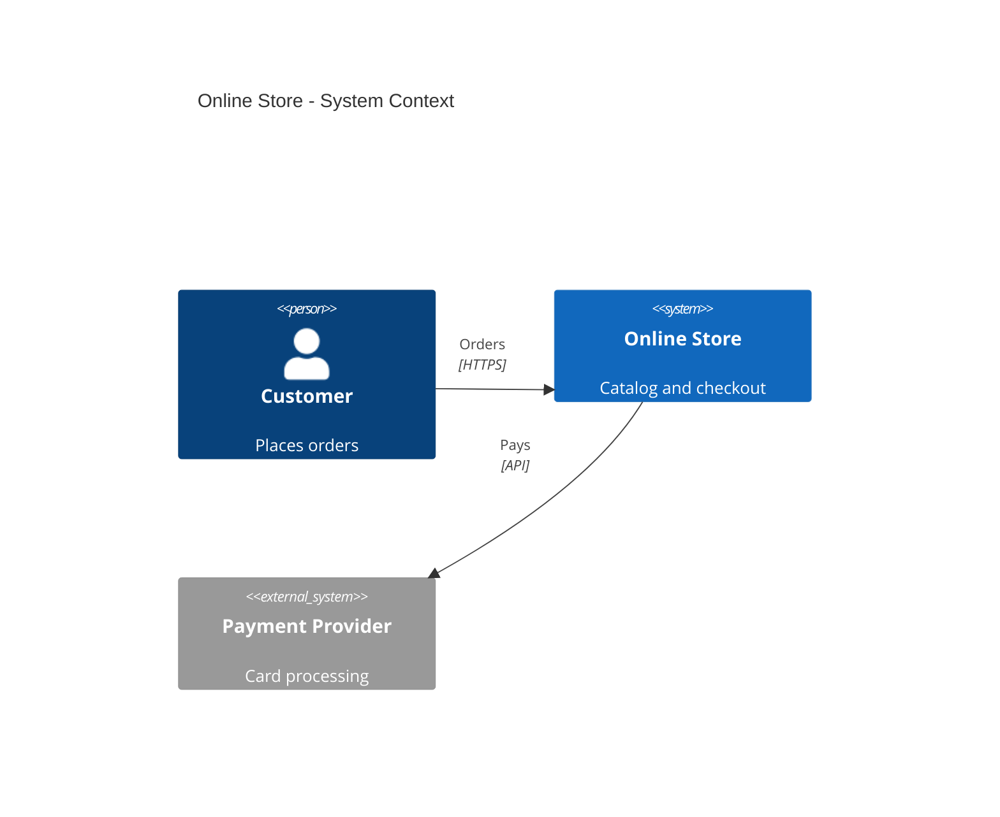
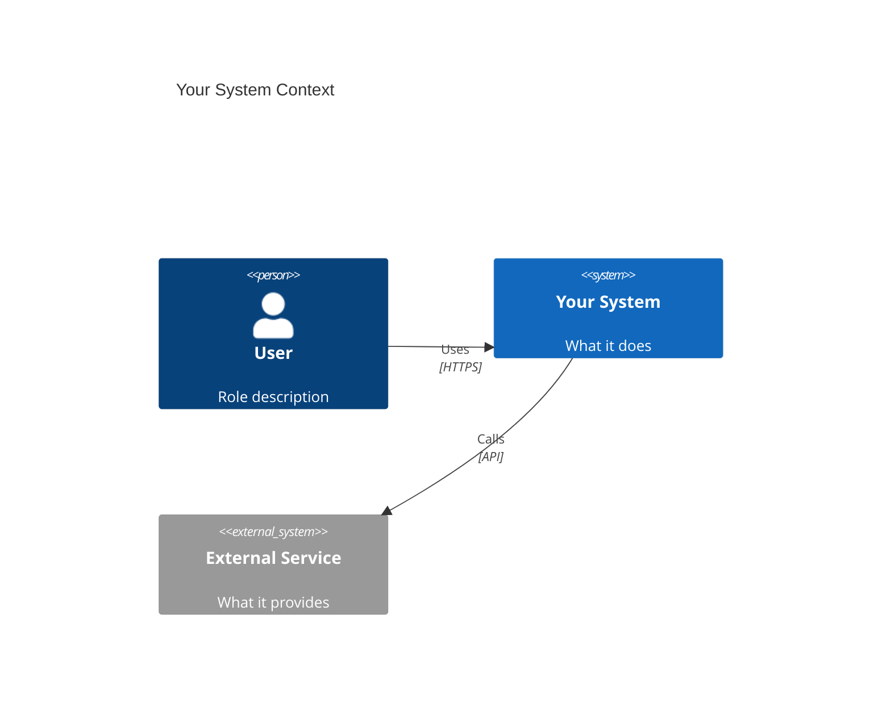
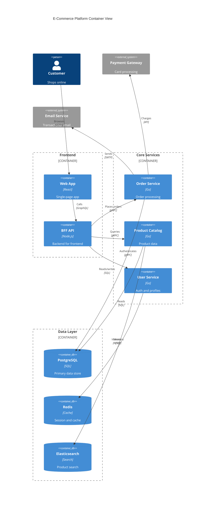

<!-- Source: https://github.com/SuperiorByteWorks-LLC/agent-project | License: Apache-2.0 | Author: Clayton Young / Superior Byte Works, LLC (Boreal Bytes) -->

# C4 Diagram

> **Back to [Style Guide](../mermaid_style_guide.md)** — Read the style guide first for emoji, color, and accessibility rules.

**Syntax keyword:** `C4Context`, `C4Container`, `C4Component`
**Best for:** System architecture at varying zoom levels — context, containers, components
**When NOT to use:** Infrastructure topology (use [Architecture](architecture.md)), runtime sequences (use [Sequence](sequence.md))

---

## Exemplar Diagram — System Context

---

## C4 Zoom Levels

| Level         | Keyword       | Shows                                   | Audience        |
| ------------- | ------------- | --------------------------------------- | --------------- |
| **Context**   | `C4Context`   | Systems + external actors               | Everyone        |
| **Container** | `C4Container` | Apps, databases, queues within a system | Technical leads |
| **Component** | `C4Component` | Internal modules within a container     | Developers      |

## Tips

- Use `Person()` for human actors
- Use `System()` for internal systems, `System_Ext()` for external
- Use `Container()`, `ContainerDb()`, `ContainerQueue()` at the container level
- Label relationships with **verbs** and **protocols**: `"Reads from", "SQL/TLS"`
- Use `Container_Boundary(id, "name") { ... }` to group containers
- **Keep descriptions short** — long text causes label overlaps
- **Limit to 4–5 elements** at the Context level to avoid crowding
- **Avoid emoji in C4 labels** — the C4 renderer handles its own styling
- Use `UpdateRelStyle()` to adjust label positions if overlaps occur

---

## Template

---

## Complex Example

A C4 Container diagram for an e-commerce platform with 3 `Container_Boundary` groups, 10 containers, and 2 external systems. Shows how to use boundaries to organize services by layer, with `UpdateRelStyle` offsets preventing label overlaps.

### Why this works

- **Container_Boundary groups map to deployment units** — frontend, core services, and data layer each correspond to real infrastructure boundaries (CDN, Kubernetes namespace, managed databases)
- **Every `Rel` has `UpdateRelStyle`** — C4's auto-layout stacks labels on top of each other by default. Offset every relationship to prevent overlaps, even if it seems fine at first (adding elements later will shift things)
- **Descriptions are kept to 1-3 words** — "Card processing", "Session and cache", "Auth and profiles". Long descriptions are the #1 cause of C4 rendering issues
- **Container types are semantic** — `ContainerDb` for databases gives them the cylinder icon, `Container` for services. The C4 renderer provides its own visual differentiation
