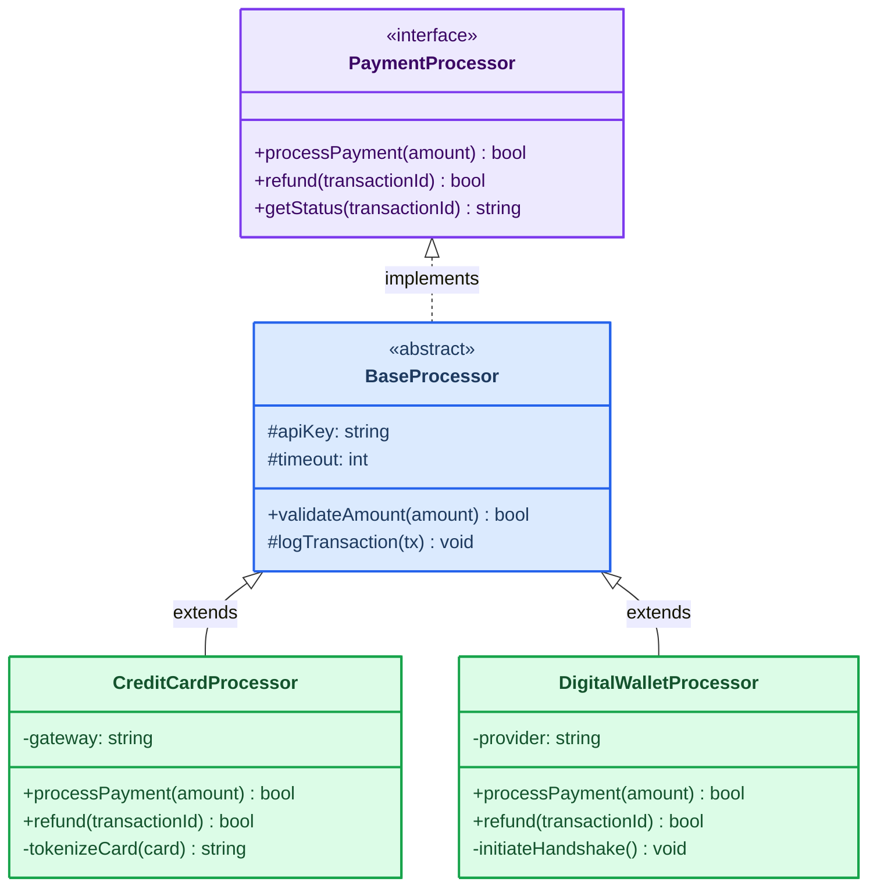
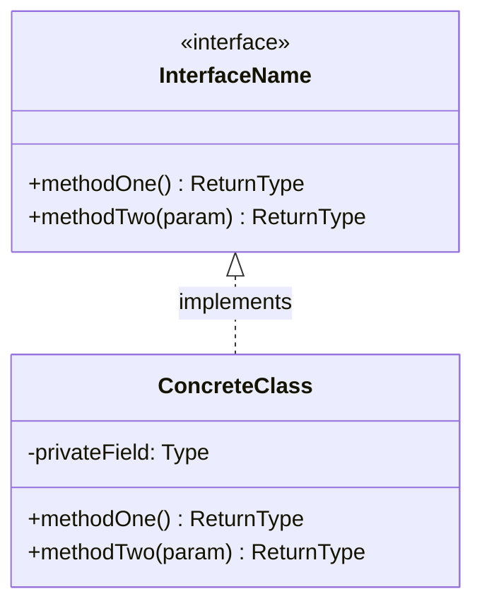
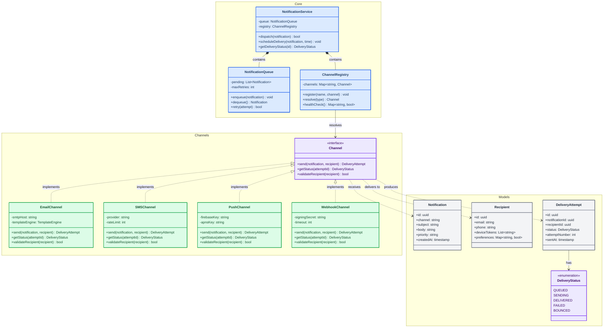

<!-- Source: https://github.com/SuperiorByteWorks-LLC/agent-project | License: Apache-2.0 | Author: Clayton Young / Superior Byte Works, LLC (Boreal Bytes) -->

# Class Diagram

> **Back to [Style Guide](../mermaid_style_guide.md)** — Read the style guide first for emoji, color, and accessibility rules.

**Syntax keyword:** `classDiagram`
**Best for:** Object-oriented design, type hierarchies, interface contracts, domain models
**When NOT to use:** Database schemas (use [ER](er.md)), runtime behavior (use [Sequence](sequence.md))

---

## Exemplar Diagram

---

## Tips

- Use `<<interface>>` and `<<abstract>>` stereotypes for clarity
- Show visibility: `+` public, `-` private, `#` protected
- Keep to **4–6 classes** per diagram — split larger hierarchies
- Use `style ClassName fill:...,stroke:...,color:...` for light semantic coloring:
  - 🟣 Purple for interfaces/abstractions
  - 🔵 Blue for base/abstract classes
  - 🟢 Green for concrete implementations
- Relationship arrows:
  - `<|--` inheritance (extends)
  - `<|..` implementation (implements)
  - `*--` composition · `o--` aggregation · `-->` dependency

---

## Template

---

## Complex Example

An event-driven notification platform with 11 classes organized into 3 `namespace` groups — core orchestration, delivery channels, and data models. Shows interface implementation, composition, and dependency relationships across layers.

### Why this works

- **3 namespaces mirror architectural layers** — Core (orchestration), Channels (delivery implementations), Models (data). A developer can scan one namespace without reading the others.
- **Color encodes the role** — purple for interfaces/enums, blue for core services, green for concrete implementations, gray for data models. The pattern is instantly recognizable.
- **Relationship types are deliberate** — composition (`*--`) for "owns and manages", implementation (`<|..`) for "fulfills contract", dependency (`..>`) for "uses at runtime". Each arrow type carries meaning.
