<!-- Source: https://github.com/SuperiorByteWorks-LLC/agent-project | License: Apache-2.0 | Author: Clayton Young / Superior Byte Works, LLC (Boreal Bytes) -->

# Composing Complex Diagram Sets

> **Back to [Style Guide](../mermaid_style_guide.md)** — This file covers how to combine multiple diagram types to document complex systems comprehensively.

**Purpose:** A single diagram captures a single perspective. Real documentation often needs multiple diagram types working together — an overview flowchart linked to a detailed sequence diagram, an ER schema paired with a state machine showing entity lifecycle, a Gantt timeline complemented by architecture before/after views. This file teaches you when and how to compose diagrams for maximum clarity.

---

## When to Compose Multiple Diagrams

| What you're documenting  | Diagram combination                                                              | Why it works                                                                        |
| ------------------------ | -------------------------------------------------------------------------------- | ----------------------------------------------------------------------------------- |
| Full system architecture | C4 Context + Architecture + Sequence (key flows)                                 | Context for stakeholders, infrastructure for ops, sequences for developers          |
| API design documentation | ER (data model) + Sequence (request flows) + State (entity lifecycle)            | Schema for the database team, interactions for backend, states for business logic   |
| Feature specification    | Flowchart (happy path) + Sequence (service interactions) + User Journey (UX)     | Process for PM, implementation for engineers, experience for design                 |
| Migration project        | Gantt (timeline) + Architecture (before/after) + Flowchart (migration process)   | Schedule for leadership, topology for infra, steps for the migration team           |
| Onboarding documentation | User Journey + Flowchart (setup steps) + Sequence (first API call)               | Experience map for product, checklist for new hires, technical walkthrough for devs |
| Incident response        | State (alert lifecycle) + Sequence (escalation flow) + Flowchart (decision tree) | Status tracking for on-call, communication for management, triage for responders    |

---

## Pattern 1: Overview + Detail

**When to use:** You need both the big picture AND the specifics. Leadership sees the overview; engineers drill into the detail.

The overview diagram shows high-level phases or components. One or more detail diagrams zoom into specific phases showing the internal interactions.

### Overview — Release Pipeline

```mermaid
flowchart LR
    accTitle: Release Pipeline Overview
    accDescr: High-level four-phase release pipeline from code commit through build, staging, and production deployment

    subgraph source ["📥 Source"]
        commit[📝 Code commit] --> pr_review[🔍 PR review]
    end

    subgraph build ["🔧 Build"]
        compile[⚙️ Compile] --> test[🧪 Test suite]
        test --> scan[🔐 Security scan]
    end

    subgraph staging ["🚀 Staging"]
        deploy_stg[☁️ Deploy staging] --> smoke[🧪 Smoke tests]
        smoke --> approval{👤 Approved?}
    end

    subgraph production ["✅ Production"]
        canary[🚀 Canary **5%**] --> rollout[🚀 Full **rollout**]
        rollout --> monitor[📊 Monitor metrics]
    end

    source --> build
    build --> staging
    approval -->|Yes| production
    approval -->|No| source

    classDef phase_start fill:#dbeafe,stroke:#2563eb,stroke-width:2px,color:#1e3a5f
    classDef phase_test fill:#fef9c3,stroke:#ca8a04,stroke-width:2px,color:#713f12
    classDef phase_deploy fill:#dcfce7,stroke:#16a34a,stroke-width:2px,color:#14532d

    class commit,pr_review,compile phase_start
    class test,scan,smoke,approval phase_test
    class deploy_stg,canary,rollout,monitor phase_deploy
```

_The production deployment phase involves multiple service interactions. See the detail sequence below for the canary rollout process._

### Detail — Canary Deployment Sequence

```mermaid
sequenceDiagram
    accTitle: Canary Deployment Service Interactions
    accDescr: Detailed sequence showing how the CI server orchestrates a canary deployment through the container registry, Kubernetes cluster, and monitoring stack with automated rollback on failure

    participant ci as ⚙️ CI Server
    participant registry as 📦 Container Registry
    participant k8s as ☁️ Kubernetes
    participant monitor as 📊 Monitoring
    participant oncall as 👤 On-Call Engineer

    ci->>registry: 📤 Push tagged image
    registry-->>ci: ✅ Image stored

    ci->>k8s: 🚀 Deploy canary (5% traffic)
    k8s-->>ci: ✅ Canary pods running

    ci->>monitor: 📊 Start canary analysis
    Note over monitor: ⏰ Observe for 15 minutes

    loop 📊 Every 60 seconds
        monitor->>k8s: 🔍 Query error rate
        k8s-->>monitor: 📊 Metrics response
    end

    alt ✅ Error rate below threshold
        monitor-->>ci: ✅ Canary healthy
        ci->>k8s: 🚀 Promote to 100%
        k8s-->>ci: ✅ Full rollout complete
        ci->>monitor: 📊 Continue monitoring
    else ❌ Error rate above threshold
        monitor-->>ci: ❌ Canary failing
        ci->>k8s: 🔄 Rollback to previous
        k8s-->>ci: ✅ Rollback complete
        ci->>oncall: ⚠️ Alert: canary failed
        Note over oncall: 📋 Investigate root cause
    end
```

### How these connect

- The **overview flowchart** shows the full pipeline with subgraph-to-subgraph connections — leadership reads this to understand the release process
- The **detail sequence** zooms into "Canary 5% → Full rollout" from the Production subgraph, showing the actual service interactions an engineer would debug
- **Naming is consistent** — "Canary" and "Monitor metrics" appear in both diagrams, creating a clear bridge between overview and detail

---

## Pattern 2: Multi-Perspective Documentation

**When to use:** The same system needs to be documented for different audiences — database teams, backend engineers, and product managers each need a different view of the same feature.

This example documents a **User Authentication** feature from three perspectives.

### Data Model — for database team

```mermaid
erDiagram
    accTitle: Authentication Data Model
    accDescr: Five-entity schema for user authentication covering users, sessions, refresh tokens, login attempts, and MFA devices with cardinality relationships

    USER ||--o{ SESSION : "has"
    USER ||--o{ REFRESH_TOKEN : "owns"
    USER ||--o{ LOGIN_ATTEMPT : "produces"
    USER ||--o{ MFA_DEVICE : "registers"
    SESSION ||--|| REFRESH_TOKEN : "paired with"

    USER {
        uuid id PK "🔑 Primary key"
        string email "📧 Unique login"
        string password_hash "🔐 Bcrypt hash"
        boolean mfa_enabled "🔒 MFA flag"
        timestamp last_login "⏰ Last active"
    }

    SESSION {
        uuid id PK "🔑 Primary key"
        uuid user_id FK "👤 Session owner"
        string ip_address "🌐 Client IP"
        string user_agent "📋 Browser info"
        timestamp expires_at "⏰ Expiration"
    }

    REFRESH_TOKEN {
        uuid id PK "🔑 Primary key"
        uuid user_id FK "👤 Token owner"
        uuid session_id FK "🔗 Paired session"
        string token_hash "🔐 Hashed token"
        boolean revoked "❌ Revoked flag"
        timestamp expires_at "⏰ Expiration"
    }

    LOGIN_ATTEMPT {
        uuid id PK "🔑 Primary key"
        uuid user_id FK "👤 Attempting user"
        string ip_address "🌐 Source IP"
        boolean success "✅ Outcome"
        string failure_reason "⚠️ Why failed"
        timestamp attempted_at "⏰ Attempt time"
    }

    MFA_DEVICE {
        uuid id PK "🔑 Primary key"
        uuid user_id FK "👤 Device owner"
        string device_type "📱 TOTP or WebAuthn"
        string secret_hash "🔐 Encrypted secret"
        boolean verified "✅ Setup complete"
        timestamp registered_at "⏰ Registered"
    }
```

### Authentication Flow — for backend team

```mermaid
sequenceDiagram
    accTitle: Login Flow with MFA
    accDescr: Step-by-step authentication sequence showing credential validation, conditional MFA challenge, token issuance, and failure handling between browser, API, auth service, and database

    participant B as 👤 Browser
    participant API as 🌐 API Gateway
    participant Auth as 🔐 Auth Service
    participant DB as 💾 Database

    B->>API: 📤 POST /login (email, password)
    API->>Auth: 🔐 Validate credentials
    Auth->>DB: 🔍 Fetch user by email
    DB-->>Auth: 👤 User record

    Auth->>Auth: 🔐 Verify password hash

    alt ❌ Invalid password
        Auth->>DB: 📝 Log failed attempt
        Auth-->>API: ❌ 401 Unauthorized
        API-->>B: ❌ Invalid credentials
    else ✅ Password valid
        alt 🔒 MFA enabled
            Auth-->>API: ⚠️ 202 MFA required
            API-->>B: 📱 Show MFA prompt

            B->>API: 📤 POST /login/mfa (code)
            API->>Auth: 🔐 Verify MFA code
            Auth->>DB: 🔍 Fetch MFA device
            DB-->>Auth: 📱 Device record
            Auth->>Auth: 🔐 Validate TOTP

            alt ❌ Invalid code
                Auth-->>API: ❌ 401 Invalid code
                API-->>B: ❌ Try again
            else ✅ Code valid
                Auth->>DB: 📝 Create session + tokens
                Auth-->>API: ✅ 200 + tokens
                API-->>B: ✅ Set cookies + redirect
            end
        else 🔓 No MFA
            Auth->>DB: 📝 Create session + tokens
            Auth-->>API: ✅ 200 + tokens
            API-->>B: ✅ Set cookies + redirect
        end
    end
```

### Login Experience — for product team

```mermaid
journey
    accTitle: Login Experience Journey Map
    accDescr: User satisfaction scores across the sign-in experience for password-only users and MFA users showing friction points in the multi-factor flow

    title 👤 Login Experience
    section 🔐 Sign In
        Navigate to login          : 4 : User
        Enter email and password   : 3 : User
        Click sign in button       : 4 : User
    section 📱 MFA Challenge
        Receive MFA prompt         : 3 : MFA User
        Open authenticator app     : 2 : MFA User
        Enter 6-digit code         : 2 : MFA User
        Handle expired code        : 1 : MFA User
    section ✅ Post-Login
        Land on dashboard          : 5 : User
        See personalized content   : 5 : User
        Resume previous session    : 4 : User
```

### How these connect

- **Same entities, different views** — "User", "Session", "MFA Device" appear in the ER diagram as tables, in the sequence as participants/operations, and in the journey as experience touchpoints
- **Each audience gets actionable information** — the DB team sees indexes and cardinality, the backend team sees API contracts and error codes, the product team sees satisfaction scores and friction points
- **The journey reveals what the sequence hides** — the sequence diagram shows MFA as a clean conditional branch, but the journey map shows it's actually the worst part of the UX (scores 1-2). This drives the product decision to invest in WebAuthn/passkeys

---

## Pattern 3: Before/After Architecture

**When to use:** Migration documentation where stakeholders need to see the current state, the target state, and understand the transformation.

### Current State — Monolith

```mermaid
flowchart TB
    accTitle: Current State Monolith Architecture
    accDescr: Single Rails monolith handling all traffic through one server connected to one database showing the scaling bottleneck

    client([👤 All traffic]) --> mono[🖥️ Rails **Monolith**]
    mono --> db[(💾 Single PostgreSQL)]
    mono --> jobs[⏰ Background **jobs**]
    jobs --> db

    classDef bottleneck fill:#fee2e2,stroke:#dc2626,stroke-width:2px,color:#7f1d1d
    classDef neutral fill:#f3f4f6,stroke:#6b7280,stroke-width:2px,color:#1f2937

    class mono,db bottleneck
    class client,jobs neutral
```

> ⚠️ **Problem:** Single database is the bottleneck. Monolith can't scale horizontally. Deploy = full restart.

### Target State — Microservices

```mermaid
flowchart TB
    accTitle: Target State Microservices Architecture
    accDescr: Decomposed microservices architecture with API gateway routing to independent services each with their own data store and a shared message queue for async communication

    client([👤 All traffic]) --> gw[🌐 API **Gateway**]

    subgraph services ["⚙️ Services"]
        user_svc[👤 User Service]
        order_svc[📋 Order Service]
        product_svc[📦 Product Service]
    end

    subgraph data ["💾 Data Stores"]
        user_db[(💾 Users DB)]
        order_db[(💾 Orders DB)]
        product_db[(💾 Products DB)]
    end

    gw --> user_svc
    gw --> order_svc
    gw --> product_svc

    user_svc --> user_db
    order_svc --> order_db
    product_svc --> product_db

    order_svc --> mq[📥 Message Queue]
    mq --> user_svc
    mq --> product_svc

    classDef gateway fill:#ede9fe,stroke:#7c3aed,stroke-width:2px,color:#3b0764
    classDef service fill:#dbeafe,stroke:#2563eb,stroke-width:2px,color:#1e3a5f
    classDef datastore fill:#dcfce7,stroke:#16a34a,stroke-width:2px,color:#14532d
    classDef infra fill:#fef9c3,stroke:#ca8a04,stroke-width:2px,color:#713f12

    class gw gateway
    class user_svc,order_svc,product_svc service
    class user_db,order_db,product_db datastore
    class mq infra
```

> ✅ **Result:** Each service scales independently. Database-per-service eliminates the shared bottleneck. Async messaging decouples service dependencies.

### How these connect

- **Same layout, different complexity** — both diagrams use `flowchart TB` so the structural transformation is visually obvious. The monolith is 4 nodes; the target is 11 nodes with subgraphs.
- **Color tells the story** — the monolith uses red (danger) on the bottleneck components. The target uses blue/green/purple to show healthy, differentiated components.
- **Prose bridges the diagrams** — the ⚠️ problem callout and ✅ result callout explain _why_ the architecture changes, not just _what_ changed.

---

## Linking Diagrams in Documentation

When composing diagrams in a real document, follow these practices:

| Practice                     | Example                                                                                                                             |
| ---------------------------- | ----------------------------------------------------------------------------------------------------------------------------------- |
| **Use headers as anchors**   | `See [Authentication Flow](#authentication-flow-for-backend-team) for the full login sequence`                                      |
| **Reference specific nodes** | "The **API Gateway** from the overview connects to the services detailed below"                                                     |
| **Consistent naming**        | Same entity = same name in every diagram (User Service, not "User Svc" in one and "Users API" in another)                           |
| **Adjacent placement**       | Keep related diagrams in consecutive sections, not scattered across the document                                                    |
| **Bridging prose**           | One sentence between diagrams explaining how they connect: "The sequence below zooms into the Deploy phase from the pipeline above" |
| **Audience labels**          | Mark sections: "### Data Model — _for database team_" so readers skip to their view                                                 |

---

## Choosing Your Composition Strategy

```mermaid
flowchart TB
    accTitle: Diagram Composition Decision Tree
    accDescr: Decision flowchart for choosing between single diagram, overview plus detail, multi-perspective, or before-after composition strategies based on audience and documentation needs

    start([📋 What are you documenting?]) --> audience{👥 Multiple audiences?}

    audience -->|Yes| perspectives[📐 Multi-Perspective]
    audience -->|No| depth{📏 Need both summary and detail?}

    depth -->|Yes| overview[🔍 Overview + Detail]
    depth -->|No| change{🔄 Showing a change over time?}

    change -->|Yes| before_after[⚡ Before / After]
    change -->|No| single[📊 Single diagram is fine]

    classDef decision fill:#fef9c3,stroke:#ca8a04,stroke-width:2px,color:#713f12
    classDef result fill:#dbeafe,stroke:#2563eb,stroke-width:2px,color:#1e3a5f
    classDef start_style fill:#ede9fe,stroke:#7c3aed,stroke-width:2px,color:#3b0764

    class audience,depth,change decision
    class perspectives,overview,before_after,single result
    class start start_style
```

