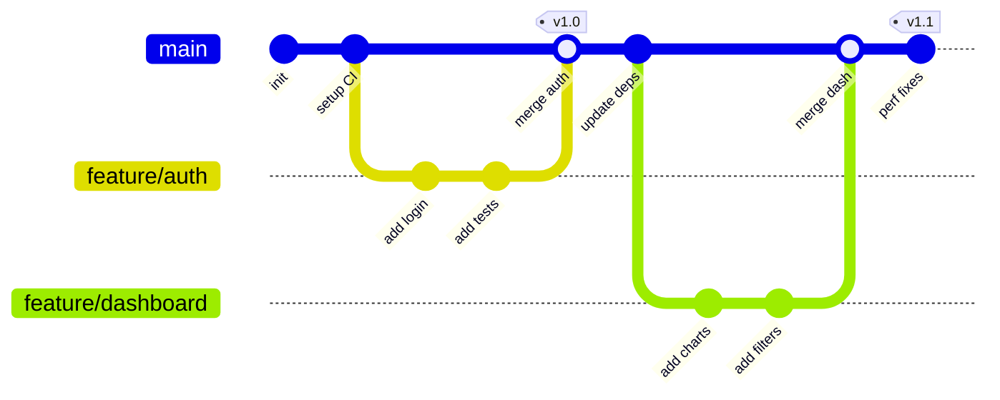
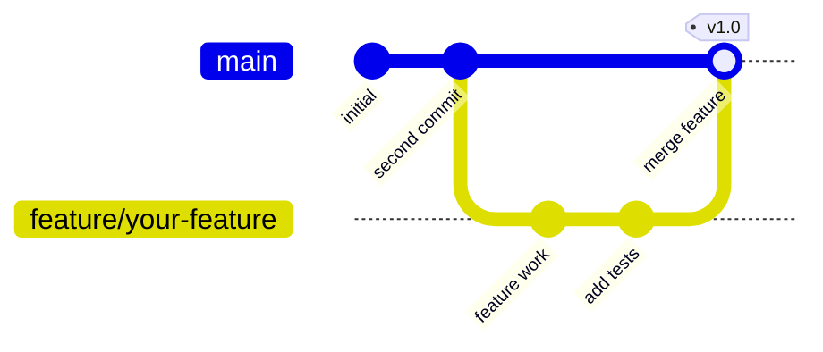

<!-- Source: https://github.com/SuperiorByteWorks-LLC/agent-project | License: Apache-2.0 | Author: Clayton Young / Superior Byte Works, LLC (Boreal Bytes) -->

# Git Graph

> **Back to [Style Guide](../mermaid_style_guide.md)** — Read the style guide first for emoji, color, and accessibility rules.

**Syntax keyword:** `gitGraph`
**Best for:** Branching strategies, merge workflows, release processes, git-flow visualization
**When NOT to use:** General processes (use [Flowchart](flowchart.md)), project timelines (use [Gantt](gantt.md))

---

## Exemplar Diagram

---

## Tips

- Use descriptive `id:` labels on commits
- Add `tag:` for release versions
- Branch names should match your actual convention (`feature/`, `fix/`, `release/`)
- Show the **ideal** workflow — this is prescriptive, not descriptive
- Use `type: HIGHLIGHT` on important merge commits
- Keep to **10–15 commits** maximum for readability

---

## Template

