<!-- Source: https://github.com/SuperiorByteWorks-LLC/agent-project | License: Apache-2.0 | Author: Clayton Young / Superior Byte Works, LLC (Boreal Bytes) -->

# Mindmap

> **Back to [Style Guide](../mermaid_style_guide.md)** — Read the style guide first for emoji, color, and accessibility rules.

**Syntax keyword:** `mindmap`
**Best for:** Brainstorming, concept organization, knowledge hierarchies, topic breakdown
**When NOT to use:** Sequential processes (use [Flowchart](flowchart.md)), timelines (use [Timeline](timeline.md))

> ⚠️ **Accessibility:** Mindmaps do **not** support `accTitle`/`accDescr`. Always place a descriptive _italic_ Markdown paragraph directly above the code block.

---

## Exemplar Diagram

_Mindmap showing a platform engineering team's key responsibility areas organized into infrastructure, developer experience, security, and observability domains:_

```mermaid
mindmap
    root((🏗️ Platform Engineering))
        ☁️ Infrastructure
            Kubernetes clusters
            Service mesh
            Load balancing
            Auto-scaling
        🔧 Developer Experience
            CI/CD pipelines
            Local dev environments
            Internal CLI tools
            Documentation
        🔐 Security
            Secret management
            Network policies
            Vulnerability scanning
            Access control
        📊 Observability
            Metrics collection
            Log aggregation
            Distributed tracing
            Alerting rules
```

---

## Tips

- Keep to **3–4 main branches** with **3–5 sub-items** each
- Use emoji on branch headers for visual distinction
- Don't nest deeper than 3 levels
- Root node uses `(( ))` for circle shape
- **Always** pair with a Markdown text description above for screen readers

---

## Template

_Description of what this mindmap shows and the key categories it covers:_

```mermaid
mindmap
    root((🎯 Central Concept))
        📋 Branch One
            Sub-item A
            Sub-item B
            Sub-item C
        🔧 Branch Two
            Sub-item D
            Sub-item E
        📊 Branch Three
            Sub-item F
            Sub-item G
            Sub-item H
```

