<!-- Source: https://github.com/SuperiorByteWorks-LLC/agent-project | License: Apache-2.0 | Author: Clayton Young / Superior Byte Works, LLC (Boreal Bytes) -->

# Pie Chart

> **Back to [Style Guide](../mermaid_style_guide.md)** — Read the style guide first for emoji, color, and accessibility rules.

**Syntax keyword:** `pie`
**Best for:** Simple proportional breakdowns, budget allocation, composition, survey results
**When NOT to use:** Trends over time (use [XY Chart](xy_chart.md)), exact comparisons (use a table), more than 7 categories

---

## Exemplar Diagram

```mermaid
pie
    accTitle: Engineering Time Allocation
    accDescr: Pie chart showing how engineering team time is distributed across feature work, tech debt, bug fixes, on-call, and learning

    title 📊 Engineering Time Allocation
    "🔧 Feature development" : 45
    "🔄 Tech debt reduction" : 20
    "🐛 Bug fixes" : 20
    "📱 On-call & support" : 10
    "📚 Learning & growth" : 5
```

---

## Tips

- Values are proportional — they don't need to sum to 100
- Use descriptive labels with **emoji prefix** for visual distinction
- Limit to **7 slices maximum** — group small ones into "📦 Other"
- Always include a `title` with relevant emoji
- Order slices largest to smallest for readability

---

## Template

```mermaid
pie
    accTitle: Your Title Here
    accDescr: Describe what proportions are being shown

    title 📊 Your Chart Title
    "📋 Category A" : 40
    "🔧 Category B" : 30
    "📦 Category C" : 20
    "🗂️ Other" : 10
```

