<!-- Source: https://github.com/SuperiorByteWorks-LLC/agent-project | License: Apache-2.0 | Author: Clayton Young / Superior Byte Works, LLC (Boreal Bytes) -->

# Quadrant Chart

> **Back to [Style Guide](../mermaid_style_guide.md)** — Read the style guide first for emoji, color, and accessibility rules.

**Syntax keyword:** `quadrantChart`
**Best for:** Prioritization matrices, risk assessment, two-axis comparisons, effort/impact analysis
**When NOT to use:** Time-based data (use [Gantt](gantt.md) or [XY Chart](xy_chart.md)), simple rankings (use a table)

> ⚠️ **Accessibility:** Quadrant charts do **not** support `accTitle`/`accDescr`. Always place a descriptive _italic_ Markdown paragraph directly above the code block.

---

## Exemplar Diagram

_Priority matrix plotting engineering initiatives by effort required versus business impact, helping teams decide what to build next:_

```mermaid
quadrantChart
    title 🎯 Engineering Priority Matrix
    x-axis Low Effort --> High Effort
    y-axis Low Impact --> High Impact
    quadrant-1 Do First
    quadrant-2 Plan Carefully
    quadrant-3 Reconsider
    quadrant-4 Quick Wins
    Upgrade auth library: [0.3, 0.9]
    Migrate to new DB: [0.9, 0.8]
    Fix typos in docs: [0.1, 0.2]
    Add dark mode: [0.4, 0.6]
    Rewrite legacy API: [0.95, 0.95]
    Update CI cache: [0.15, 0.5]
    Add unit tests: [0.5, 0.7]
```

---

## Tips

- Label axes with `Low X --> High X` format
- Name all four quadrants with **actionable** labels
- Plot items as `Name: [x, y]` with values 0.0–1.0
- Limit to **5–10 items** — more becomes cluttered
- Quadrant numbering: 1=top-right, 2=top-left, 3=bottom-left, 4=bottom-right
- **Always** pair with a Markdown text description above for screen readers

---

## Template

_Description of the two axes and what the quadrant placement means:_

```mermaid
quadrantChart
    title 🎯 Your Matrix Title
    x-axis Low X Axis --> High X Axis
    y-axis Low Y Axis --> High Y Axis
    quadrant-1 High Both
    quadrant-2 High Y Only
    quadrant-3 Low Both
    quadrant-4 High X Only
    Item A: [0.3, 0.8]
    Item B: [0.7, 0.6]
    Item C: [0.2, 0.3]
```

