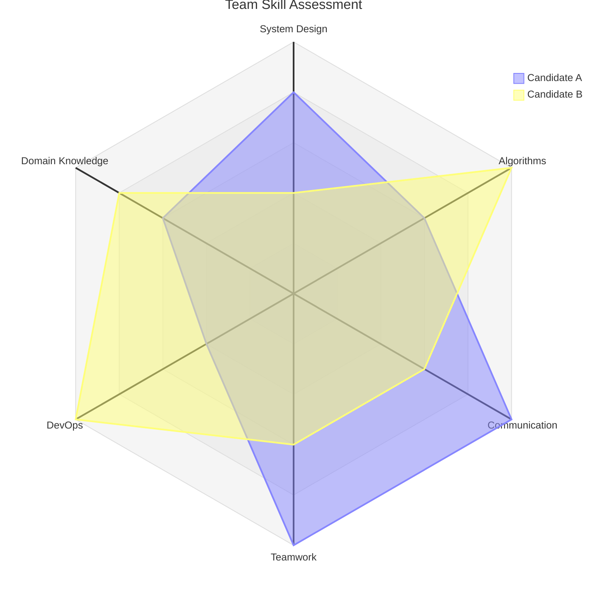
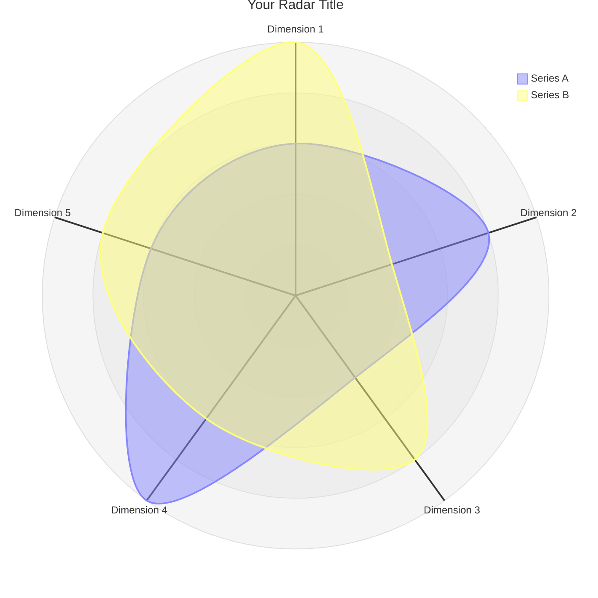

<!-- Source: https://github.com/SuperiorByteWorks-LLC/agent-project | License: Apache-2.0 | Author: Clayton Young / Superior Byte Works, LLC (Boreal Bytes) -->

# Radar Chart

> **Back to [Style Guide](../mermaid_style_guide.md)** — Read the style guide first for emoji, color, and accessibility rules.

**Syntax keyword:** `radar-beta`
**Mermaid version:** v11.6.0+
**Best for:** Multi-dimensional comparisons, skill assessments, performance profiles, competitive analysis
**When NOT to use:** Time series data (use [XY Chart](xy_chart.md)), simple proportions (use [Pie](pie.md))

> ⚠️ **Accessibility:** Radar charts do **not** support `accTitle`/`accDescr`. Always place a descriptive _italic_ Markdown paragraph directly above the code block.

---

## Exemplar Diagram

_Radar chart comparing two engineering candidates across six core competency areas, showing complementary strengths:_

---

## Tips

- Define axes with `axis id["Label"]` — use short labels (1–2 words)
- Define curves with `curve id["Label"]{val1, val2, ...}` matching axis order
- Set `max` to normalize all values to the same scale
- `graticule` options: `circle` (default) or `polygon`
- `ticks` controls the number of concentric rings (default 5)
- `showLegend true` adds a legend for multiple curves
- Keep to **5–8 axes** and **2–4 curves** for readability
- **Always** pair with a Markdown text description above for screen readers

---

## Template

_Description of what dimensions are being compared across which entities:_

