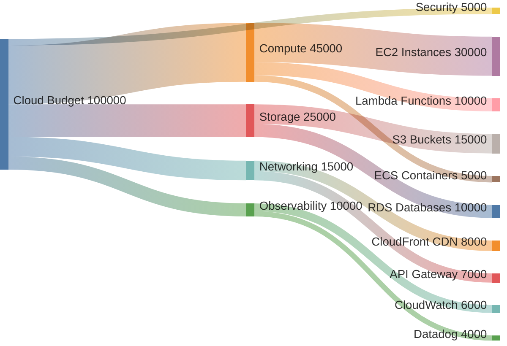
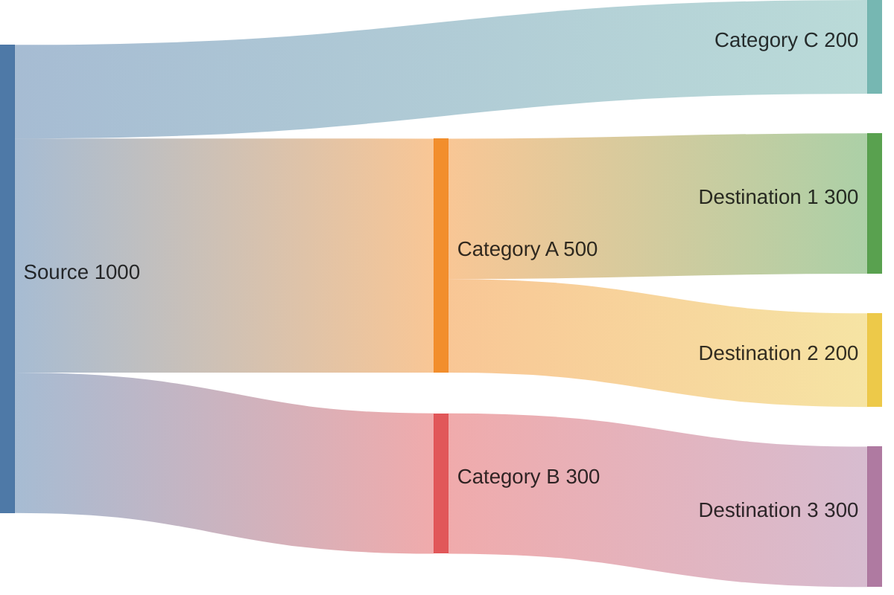

<!-- Source: https://github.com/SuperiorByteWorks-LLC/agent-project | License: Apache-2.0 | Author: Clayton Young / Superior Byte Works, LLC (Boreal Bytes) -->

# Sankey Diagram

> **Back to [Style Guide](../mermaid_style_guide.md)** — Read the style guide first for emoji, color, and accessibility rules.

**Syntax keyword:** `sankey-beta`
**Best for:** Flow magnitude visualization, resource distribution, budget allocation, traffic routing
**When NOT to use:** Simple proportions (use [Pie](pie.md)), process steps (use [Flowchart](flowchart.md))

> ⚠️ **Accessibility:** Sankey diagrams do **not** support `accTitle`/`accDescr`. Always place a descriptive _italic_ Markdown paragraph directly above the code block.

---

## Exemplar Diagram

_Sankey diagram showing how a $100K monthly cloud budget flows from the total allocation through service categories (compute, storage, networking, observability) to specific AWS services, with band widths proportional to cost:_

---

## Tips

- Format: `Source,Target,Value` — one flow per line
- Values determine the width of each flow band
- Keep to **3 levels** maximum (source → category → destination)
- Blank lines between groups improve source readability
- Good for answering "where does the 💰 go?" questions
- No emoji in node names (parser limitation) — use descriptive text
- **Always** pair with a Markdown text description above for screen readers

---

## Template

_Description of what flows from where to where and what the magnitudes represent:_

