<!-- Source: https://github.com/SuperiorByteWorks-LLC/agent-project | License: Apache-2.0 | Author: Clayton Young / Superior Byte Works, LLC (Boreal Bytes) -->

# Sequence Diagram

> **Back to [Style Guide](../mermaid_style_guide.md)** — Read the style guide first for emoji, color, and accessibility rules.

**Syntax keyword:** `sequenceDiagram`
**Best for:** API interactions, temporal flows, multi-actor communication, request/response patterns
**When NOT to use:** Simple linear processes (use [Flowchart](flowchart.md)), static relationships (use [Class](class.md) or [ER](er.md))

---

## Exemplar Diagram

```mermaid
sequenceDiagram
    accTitle: OAuth 2.0 Authorization Code Flow
    accDescr: Step-by-step OAuth flow between user browser, app server, and identity provider showing the token exchange and error path

    participant U as 👤 User Browser
    participant A as 🖥️ App Server
    participant I as 🔐 Identity Provider

    U->>A: Click Sign in
    A-->>U: Redirect to IdP

    U->>I: Enter credentials
    I->>I: 🔍 Validate credentials

    alt ✅ Valid credentials
        I-->>U: Redirect with auth code
        U->>A: Send auth code
        A->>I: Exchange code for token
        I-->>A: 🔐 Access + refresh token
        A-->>U: ✅ Set session cookie
        Note over U,A: 🔒 User is now authenticated
    else ❌ Invalid credentials
        I-->>U: ⚠️ Show error message
    end
```



---

## Tips

- Limit to **4–5 participants** — more becomes unreadable
- Solid arrows (`->>`) for requests, dashed (`-->>`) for responses
- Use `alt/else/end` for conditional branches
- Use `Note over X,Y:` for contextual annotations with emoji
- Use `par/end` for parallel operations
- Use `loop/end` for repeated interactions
- Emoji in **message text** works great for status clarity (✅, ❌, ⚠️, 🔐)

## Common Patterns

**Parallel calls:**

```
par 📥 Fetch user
    A->>B: GET /user
and 📥 Fetch orders
    A->>C: GET /orders
end
```

**Loops:**

```
loop ⏰ Every 30 seconds
    A->>B: Health check
    B-->>A: ✅ 200 OK
end
```

---

## Template

```mermaid
sequenceDiagram
    accTitle: Your Title Here
    accDescr: Describe the interaction between participants and what the sequence demonstrates

    participant A as 👤 Actor
    participant B as 🖥️ System
    participant C as 💾 Database

    A->>B: 📤 Request action
    B->>C: 🔍 Query data
    C-->>B: 📥 Return results
    B-->>A: ✅ Deliver response
```



---

## Complex Example

A microservices checkout flow with 6 participants grouped in `box` regions. Shows parallel calls, conditional branching, error handling with `break`, retry logic, and contextual notes — the full toolkit for complex sequences.

```mermaid
sequenceDiagram
    accTitle: Microservices Checkout Flow
    accDescr: Multi-service checkout sequence showing parallel inventory and payment processing, error recovery with retries, and async notification dispatch across client, gateway, and backend service layers

    box rgb(237,233,254) 🌐 Client Layer
        participant browser as 👤 Browser
    end

    box rgb(219,234,254) 🖥️ API Layer
        participant gw as 🌐 API Gateway
        participant order as 📋 Order Service
    end

    box rgb(220,252,231) ⚙️ Backend Services
        participant inventory as 📦 Inventory
        participant payment as 💰 Payment
        participant notify as 📤 Notifications
    end

    browser->>gw: 🛒 Submit checkout
    gw->>gw: 🔐 Validate JWT token
    gw->>order: 📋 Create order

    Note over order: 📊 Order status: PENDING

    par ⚡ Parallel validation
        order->>inventory: 📦 Reserve items
        inventory-->>order: ✅ Items reserved
    and
        order->>payment: 💰 Authorize card
        payment-->>order: ✅ Payment authorized
    end

    alt ✅ Both succeeded
        order->>payment: 💰 Capture payment
        payment-->>order: ✅ Payment captured
        order->>inventory: 📦 Confirm reservation

        Note over order: 📊 Order status: CONFIRMED

        par 📤 Async notifications
            order->>notify: 📧 Send confirmation email
        and
            order->>notify: 📱 Send push notification
        end

        order-->>gw: ✅ Order confirmed
        gw-->>browser: ✅ Show confirmation page

    else ❌ Inventory unavailable
        order->>payment: 🔄 Void authorization
        order-->>gw: ⚠️ Items out of stock
        gw-->>browser: ⚠️ Show stock error

    else ❌ Payment declined
        order->>inventory: 🔄 Release reservation

        loop 🔄 Retry up to 2 times
            order->>payment: 💰 Retry authorization
            payment-->>order: ❌ Still declined
        end

        order-->>gw: ❌ Payment failed
        gw-->>browser: ❌ Show payment error
    end
```



### Why this works

- **`box` grouping** clusters participants by architectural layer — readers instantly see which services are client-facing vs backend
- **`par` blocks** show parallel inventory + payment checks happening simultaneously, which is how real checkout systems work for performance
- **Nested `alt`/`else`** covers the happy path AND two distinct failure modes, each with proper cleanup (void auth, release reservation)
- **`loop` for retry logic** shows the payment retry pattern without cluttering the happy path
- **Emoji in messages** makes scanning fast — 📦 for inventory, 💰 for payment, ✅/❌ for outcomes
