<!-- Source: https://github.com/SuperiorByteWorks-LLC/agent-project | License: Apache-2.0 | Author: Clayton Young / Superior Byte Works, LLC (Boreal Bytes) -->

# State Diagram

> **Back to [Style Guide](../mermaid_style_guide.md)** — Read the style guide first for emoji, color, and accessibility rules.

**Syntax keyword:** `stateDiagram-v2`
**Best for:** State machines, lifecycle flows, status transitions, object lifecycles
**When NOT to use:** Sequential processes with many steps (use [Flowchart](flowchart.md)), timing-critical interactions (use [Sequence](sequence.md))

---

## Exemplar Diagram

```mermaid
stateDiagram-v2
    accTitle: Order Fulfillment Lifecycle
    accDescr: State machine for an e-commerce order from placement through payment, fulfillment, and delivery with cancellation paths

    [*] --> Placed: 📋 Customer submits

    Placed --> PaymentPending: 💰 Initiate payment
    PaymentPending --> PaymentFailed: ❌ Declined
    PaymentPending --> Confirmed: ✅ Payment received

    PaymentFailed --> Placed: 🔄 Retry payment
    PaymentFailed --> Cancelled: 🚫 Customer cancels

    Confirmed --> Picking: 📦 Warehouse picks
    Picking --> Shipped: 🚚 Carrier collected
    Shipped --> Delivered: ✅ Proof of delivery
    Delivered --> [*]: 🏁 Complete

    Cancelled --> [*]: 🏁 Closed

    note right of Confirmed
        📋 Inventory reserved
        💰 Invoice generated
    end note
```

---

## Tips

- Always start with `[*]` (initial state) and end with `[*]` (terminal)
- Label transitions with **emoji + action** for visual clarity
- Use `note right of` / `note left of` for contextual details
- State names: `CamelCase` (Mermaid convention for state diagrams)
- Use nested states sparingly: `state "name" as s1 { ... }`
- Keep to **8–10 states** maximum

---

## Template

```mermaid
stateDiagram-v2
    accTitle: Your Title Here
    accDescr: Describe the entity lifecycle and key transitions between states

    [*] --> InitialState: ⚡ Trigger event

    InitialState --> ActiveState: ▶️ Action taken
    ActiveState --> CompleteState: ✅ Success
    ActiveState --> FailedState: ❌ Error

    CompleteState --> [*]: 🏁 Done
    FailedState --> [*]: 🏁 Closed
```

---

## Complex Example

A CI/CD pipeline modeled as a state machine with 3 composite (nested) states, each containing internal substates. Shows how source changes flow through build, test, and deploy phases with failure recovery and rollback transitions.

```mermaid
stateDiagram-v2
    accTitle: CI/CD Pipeline State Machine
    accDescr: Composite state diagram for a CI/CD pipeline showing source detection, build and test phases with parallel scanning, and a three-stage deployment with approval gate and rollback path

    [*] --> Source: ⚡ Commit pushed

    state "📥 Source" as Source {
        [*] --> Idle
        Idle --> Fetching: 🔄 Poll detected change
        Fetching --> Validating: 📋 Checkout complete
        Validating --> [*]: ✅ Config valid
    }

    Source --> Build: ⚙️ Pipeline triggered

    state "🔧 Build & Test" as Build {
        [*] --> Compiling
        Compiling --> UnitTests: ✅ Build artifact ready
        UnitTests --> IntegrationTests: ✅ Unit tests pass
        IntegrationTests --> SecurityScan: ✅ Integration pass
        SecurityScan --> [*]: ✅ No vulnerabilities

        note right of Compiling
            📦 Docker image built
            🏷️ Tagged with commit SHA
        end note
    }

    Build --> Deploy: 📦 Artifact published
    Build --> Failed: ❌ Build or test failure

    state "🚀 Deployment" as Deploy {
        [*] --> Staging
        Staging --> WaitApproval: ✅ Staging healthy
        WaitApproval --> Production: ✅ Approved
        WaitApproval --> Cancelled: 🚫 Rejected
        Production --> Monitoring: 🚀 Deployed
        Monitoring --> [*]: ✅ Stable 30 min

        note right of WaitApproval
            👤 Requires team lead approval
            ⏰ Auto-reject after 24h
        end note
    }

    Deploy --> Rollback: ❌ Health check failed
    Rollback --> Deploy: 🔄 Revert to previous
    Deploy --> Complete: 🏁 Pipeline finished
    Failed --> Source: 🔧 Fix pushed
    Cancelled --> [*]: 🏁 Pipeline aborted
    Complete --> [*]: 🏁 Done

    state Failed {
        [*] --> AnalyzeFailure
        AnalyzeFailure --> NotifyTeam: 📤 Alert sent
        NotifyTeam --> [*]
    }

    state Rollback {
        [*] --> RevertArtifact
        RevertArtifact --> RestorePrevious: 🔄 Previous version
        RestorePrevious --> VerifyRollback: 🔍 Health check
        VerifyRollback --> [*]
    }
```

### Why this works

- **Composite states group pipeline phases** — Source, Build & Test, and Deployment each contain their internal flow, readable in isolation or as part of the whole
- **Failure and rollback are first-class states** — not just transition labels. The Failed and Rollback states have their own internal substates showing what actually happens during recovery
- **Notes on key states** add operational context — the approval gate has timeout rules, the compile step documents the artifact format. This is the kind of detail operators need.
- **Transitions between composite states** are the high-level flow (Source → Build → Deploy → Complete), while transitions within composites are the detailed steps. Two levels of reading for two audiences.
