<!-- Source: https://github.com/SuperiorByteWorks-LLC/agent-project | License: Apache-2.0 | Author: Clayton Young / Superior Byte Works, LLC (Boreal Bytes) -->

# XY Chart

> **Back to [Style Guide](../mermaid_style_guide.md)** — Read the style guide first for emoji, color, and accessibility rules.

**Syntax keyword:** `xychart-beta`
**Best for:** Numeric data visualization, trends over time, bar/line comparisons, metric dashboards
**When NOT to use:** Proportional breakdowns (use [Pie](pie.md)), qualitative comparisons (use [Quadrant](quadrant.md))

> ⚠️ **Accessibility:** XY charts do **not** support `accTitle`/`accDescr`. Always place a descriptive _italic_ Markdown paragraph directly above the code block.

---

## Exemplar Diagram

_XY chart comparing monthly revenue growth (bars) versus customer acquisition cost (line) over six months, showing improving unit economics as revenue rises while CAC steadily decreases:_

```mermaid
xychart-beta
    title "📈 Revenue vs Customer Acquisition Cost"
    x-axis [Jan, Feb, Mar, Apr, May, Jun]
    y-axis "Thousands ($)" 0 --> 120
    bar [20, 35, 48, 62, 78, 95]
    line [50, 48, 45, 40, 35, 30]
```

---

## Tips

- Combine `bar` and `line` to show different metrics on the same chart
- Use **emoji in the title** for visual flair: `"📈 Revenue Growth"`
- Use quoted `title` and axis labels
- Define axis range with `min --> max`
- Keep data points to **6–12** for readability
- Multiple `bar` or `line` entries create grouped series
- **Always** pair with a detailed Markdown text description above for screen readers

---

## Template

_Description of what the X axis, Y axis, bars, and lines represent and the key insight:_

```mermaid
xychart-beta
    title "📊 Your Chart Title"
    x-axis [Label1, Label2, Label3, Label4]
    y-axis "Unit" 0 --> 100
    bar [25, 50, 75, 60]
    line [30, 45, 70, 55]
```

