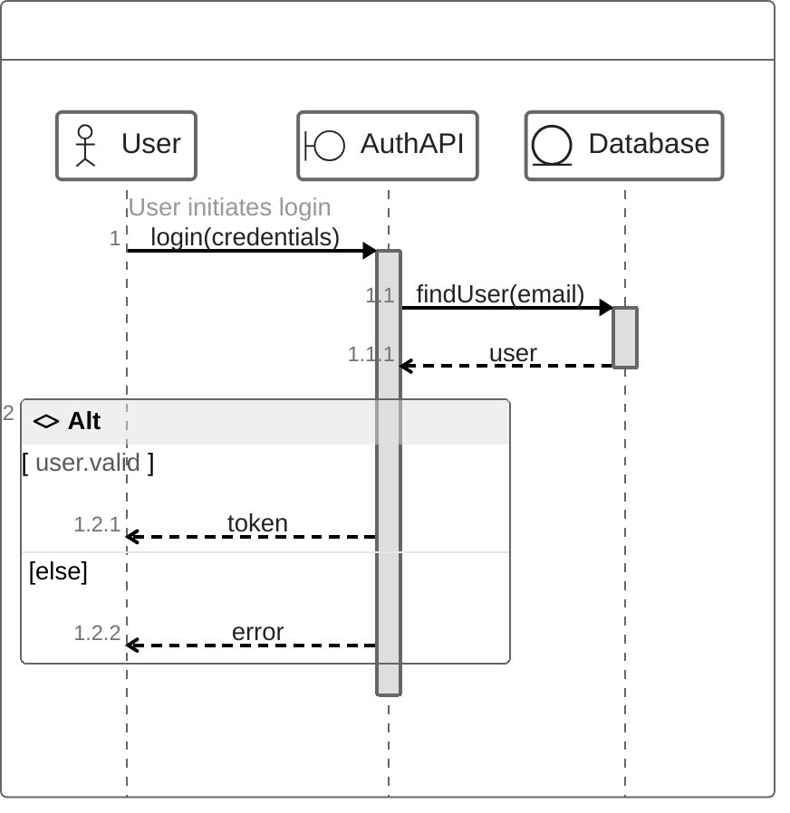
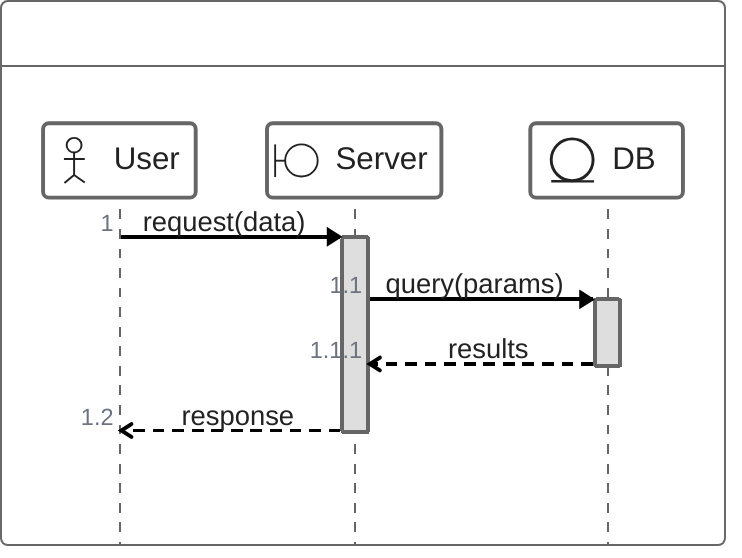

<!-- Source: https://github.com/SuperiorByteWorks-LLC/agent-project | License: Apache-2.0 | Author: Clayton Young / Superior Byte Works, LLC (Boreal Bytes) -->

# ZenUML Sequence Diagram

> **Back to [Style Guide](../mermaid_style_guide.md)** — Read the style guide first for emoji, color, and accessibility rules.

**Syntax keyword:** `zenuml`
**Best for:** Code-like sequence diagrams, method-call-style interactions, developers familiar with programming syntax
**When NOT to use:** Prefer standard [Sequence Diagrams](sequence.md) for most use cases — ZenUML requires an external plugin and has limited GitHub support.

> ⚠️ **GitHub support:** ZenUML requires the `@mermaid-js/mermaid-zenuml` external module. It may **not render** on GitHub natively. Use standard `sequenceDiagram` syntax for GitHub compatibility.
>
> ⚠️ **Accessibility:** ZenUML does **not** support `accTitle`/`accDescr`. Always place a descriptive _italic_ Markdown paragraph directly above the code block.

---

## Exemplar Diagram

_ZenUML sequence diagram showing a user authentication flow with credential validation and token generation using programming-style syntax:_

---

## Tips

- Uses **programming-style syntax** with method calls: `A->B.method(args)`
- Curly braces `{}` create natural nesting (activation bars)
- Control flow: `if/else`, `while`, `for`, `try/catch/finally`, `par`
- Participant types: `@Actor`, `@Boundary`, `@Entity`, `@Database`, `@Control`
- Comments with `//` render above messages
- `return` keyword draws return arrows
- **Prefer standard `sequenceDiagram`** for GitHub compatibility
- Use ZenUML only when the code-style syntax is specifically desired

---

## Template

_Description of the interaction flow:_

