<!-- Source: https://github.com/SuperiorByteWorks-LLC/agent-project | License: Apache-2.0 | Author: Clayton Young / Superior Byte Works, LLC (Boreal Bytes) -->

# Issue Documentation Template

> **Back to [Markdown Style Guide](../markdown_style_guide.md)** — Read the style guide first for formatting, citation, and emoji rules.

**Use this template for:** Documenting bugs, feature requests, improvement proposals, incidents, or any trackable work item as a persistent markdown record. This file IS the issue — the full lifecycle from report through investigation, resolution, and lessons learned — in a format that's searchable, portable, and part of your codebase.

**Key features:** Classification with severity/priority, customer impact quantification, reproduction steps with expected vs actual, investigation log, resolution with root cause, acceptance criteria for feature requests, and SLA tracking.

**Philosophy:** This file is the source of truth for the issue — not GitHub Issues, not Jira, not Linear. Those platforms are notification and comment layers. The full lifecycle — report, investigation, root cause, fix, and lessons learned — lives HERE, committed to the repo.

An issue report is a contract between the reporter and the resolver. Vague issues get vague fixes. The best issue documents are so clear that anyone on the team — or any AI agent — could pick them up, understand the problem, and start working without asking a single clarifying question. Include everything. Assume the person reading this has zero prior context.

This is the [Everything is Code](../markdown_style_guide.md#-everything-is-code) philosophy: any agent or team member can find, read, and update issues with file access alone. No API, no tokens, no platform lock-in. `grep docs/project/issues/` beats searching Jira every time.

---

## File Convention

```
docs/project/issues/issue-00000456-fix-session-timeout-race.md
docs/project/issues/issue-00000457-add-csv-export-filtering.md
docs/project/issues/issue-00000458-improve-onboarding-copy.md
```

- **Directory:** `docs/project/issues/`
- **Naming:** `issue-` + issue number zero-padded to 8 digits + `-` + short lowercase hyphenated description
- **Cross-reference:** Link to the live issue tracker in the metadata table

---

## Template Variants

This template has two variants — use the section that matches your issue type:

- **[Bug report](#bug-report-template)** — Something is broken, behaving unexpectedly, or crashing
- **[Feature request](#feature-request-template)** — Something new that should exist

---

## Bug Report Template

---

# Issue-[NUMBER]: [Short Description of the Bug]

| Field                  | Value                                                                                             |
| ---------------------- | ------------------------------------------------------------------------------------------------- |
| **Issue**              | `#NUMBER` (add tracker URL if your project uses one)                                              |
| **Type**               | 🐛 Bug                                                                                            |
| **Severity**           | 🟢 Low / 🟡 Medium / 🔴 High / 💀 Critical                                                        |
| **Priority**           | P0 / P1 / P2 / P3                                                                                 |
| **Reporter**           | [Name]                                                                                            |
| **Assignee**           | [Name or Unassigned]                                                                              |
| **Date reported**      | [YYYY-MM-DD]                                                                                      |
| **Status**             | [Open / In progress / Resolved / Closed / Won't fix]                                              |
| **Users affected**     | [Count or segment — e.g., "~2,000 free-tier users" / "All API consumers"]                         |
| **Revenue impact**     | [None / Indirect / Direct — $N/day or N% of transactions]                                         |
| **Resolved in**        | [PR-#NUMBER](../../docs/project/pr/pr-00000001-agentic-docs-and-monorepo-modernization.md) or N/A |
| **Time to resolution** | [N hours / N days — from report to fix deployed]                                                  |

---

## 📋 Summary

[One paragraph: What's broken, who's affected, and how severe the impact is. Be specific — "Users can't log in" not "auth is broken."]

### Customer impact

| Dimension             | Assessment                                                                |
| --------------------- | ------------------------------------------------------------------------- |
| **Who's affected**    | [User segment, account type, region — be specific]                        |
| **How many**          | [Count, percentage, or estimate — e.g., "~500 enterprise accounts"]       |
| **Business impact**   | [Revenue, SLA violation, churn risk, reputational — quantify if possible] |
| **Workaround exists** | [Yes — describe briefly / No]                                             |

---

## 🔄 Reproduction Steps

### Environment

| Detail               | Value                                        |
| -------------------- | -------------------------------------------- |
| **Version / commit** | [App version, commit SHA, or deploy tag]     |
| **Environment**      | [Production / Staging / Local]               |
| **OS / Browser**     | [e.g., macOS 15.2, Chrome 122]               |
| **Account type**     | [Admin / Standard / Free tier — if relevant] |

### Steps to reproduce

1. [Exact step 1 — be precise: "Navigate to /settings/profile"]
2. [Exact step 2 — "Click the 'Save' button"]
3. [Exact step 3 — "Observe the error"]

**Reproducibility:** [Always / Intermittent (~N% of attempts) / Once]

### Expected behavior

[What should happen when following the steps above.]

### Actual behavior

[What actually happens. Include the exact error message, screenshot, or log output.]

```
[Paste exact error message or log output here]
```

Screenshot placeholder: `docs/project/issues/images/issue-NUMBER-screenshot.png`

### Workaround

[If users can work around this bug, describe how. If no workaround exists, state "None known." This helps support teams while the fix is in progress.]

---

## 🔍 Investigation

### Root cause

[What's actually causing the bug. Fill this in during investigation, not at report time.]

[If the root cause involves a data flow or logic issue, diagram it:]

```mermaid
flowchart TB
    accTitle: Bug Root Cause Flow
    accDescr: Diagram showing where the failure occurs in the normal processing path

    input[📥 Input] --> process[⚙️ Process]
    process --> check{🔍 Validation}
    check -->|Pass| success[✅ Expected]
    check -->|Fail| bug[❌ Bug occurs here]

    classDef bugstyle fill:#fee2e2,stroke:#dc2626,stroke-width:2px,color:#7f1d1d
    class bug bugstyle
```



### Investigation log

| Date   | Who    | Finding               |
| ------ | ------ | --------------------- |
| [Date] | [Name] | [What was discovered] |
| [Date] | [Name] | [Next finding]        |

<details>
<summary><strong>🔧 Technical Details</strong></summary>

[Stack traces, debug logs, database queries, config diffs — anything that supports the investigation but is too verbose for the main document.]

</details>

---

## ✅ Resolution

### Fix description

[What was changed to fix the bug. Link to the PR.]

**Fixed in:** [PR-#NUMBER](../../docs/project/pr/pr-00000001-agentic-docs-and-monorepo-modernization.md)

### Verification

- [ ] Fix verified in [environment]
- [ ] Regression test added
- [ ] No side effects observed
- [ ] Reporter confirmed fix

### Lessons learned

[What should change to prevent this class of bug? New test? Better validation? Monitoring alert? Process change?]

---

## 🔗 References

- [Related issues](../../docs/project/issues/issue-00000001-agentic-documentation-system.md)
- [Relevant documentation](https://example.com)
- [Monitoring dashboard or alert](https://example.com)

---

_Last updated: [Date]_

---

---

## Feature Request Template

---

# Issue-[NUMBER]: [Feature Title — What Should Exist]

| Field              | Value                                                                                             |
| ------------------ | ------------------------------------------------------------------------------------------------- |
| **Issue**          | `#NUMBER` (add tracker URL if your project uses one)                                              |
| **Type**           | ✨ Feature request                                                                                |
| **Priority**       | P0 / P1 / P2 / P3                                                                                 |
| **Requester**      | [Name or Team]                                                                                    |
| **Assignee**       | [Name or Unassigned]                                                                              |
| **Date requested** | [YYYY-MM-DD]                                                                                      |
| **Status**         | [Proposed / Accepted / In progress / Shipped / Declined]                                          |
| **Target release** | [Version, sprint, or quarter]                                                                     |
| **Shipped in**     | [PR-#NUMBER](../../docs/project/pr/pr-00000001-agentic-docs-and-monorepo-modernization.md) or N/A |

---

## 📋 Summary

### Problem statement

[What user problem or business need does this feature address? Who experiences this problem and how often? Include metrics if available.]

### Proposed solution

[High-level description of what you want built. Focus on the _what_ and _why_, not the _how_ — leave implementation details to the builder.]

### User story

> As a **[role]**, I want to **[action]** so that **[benefit]**.

---

## 🎯 Acceptance Criteria

The feature is complete when:

- [ ] [Specific, testable criterion — "User can export data as CSV from the dashboard"]
- [ ] [Another criterion — "Export includes all filtered results, not just the current page"]
- [ ] [Another criterion — "Download starts within 3 seconds for datasets under 10K rows"]
- [ ] [Non-functional — "Works on mobile viewport (375px+)"]
- [ ] [Documentation — "API endpoint documented in project docs"]

---

## 📐 Design

### User flow

```mermaid
flowchart TB
    accTitle: Feature User Flow
    accDescr: Step-by-step flow showing how a user interacts with the proposed feature

    start([👤 User action]) --> step1[⚙️ System response]
    step1 --> check{🔍 Condition?}
    check -->|Yes| success[✅ Success path]
    check -->|No| alt[🔄 Alternative path]
    alt --> step1
    success --> done([📤 Result delivered])
```



### Mockup / wireframe

[If visual, include a mockup or screenshot of the expected UI. If not visual, describe the expected behavior in detail.]

### Technical considerations

- **[Consideration 1]:** [Impact on existing architecture, data model, or APIs]
- **[Consideration 2]:** [Performance, scalability, or security implications]
- **[Consideration 3]:** [Dependencies on other features, services, or teams]

<details>
<summary><strong>📋 Implementation Notes</strong></summary>

[Deeper technical context for the implementer — suggested approach, relevant code paths, database schema changes, API contract, migration strategy. This saves the builder from discovery time.]

</details>

---

## 📊 Impact

| Dimension           | Assessment                                  |
| ------------------- | ------------------------------------------- |
| **Users affected**  | [How many users / what segment]             |
| **Revenue impact**  | [Direct, indirect, or none]                 |
| **Effort estimate** | [T-shirt size: S / M / L / XL]              |
| **Dependencies**    | [Other features, teams, or services needed] |

### Success metrics

[How will you know this feature is successful after shipping? Be specific and measurable.]

- **[Metric 1]:** [Current baseline] → [Target] within [timeframe]
- **[Metric 2]:** [Current baseline] → [Target] within [timeframe]

---

## 🔗 References

- [User feedback or support tickets](https://example.com)
- [Competitive analysis](https://example.com)
- [Related feature requests](../../docs/project/issues/issue-00000001-agentic-documentation-system.md)
- [Design document or ADR](../adr/ADR-001-agent-optimized-documentation-system.md)

---

_Last updated: [Date]_
