<!-- Source: https://github.com/SuperiorByteWorks-LLC/agent-project | License: Apache-2.0 | Author: Clayton Young / Superior Byte Works, LLC (Boreal Bytes) -->

# Presentation / Briefing Template

> **Back to [Markdown Style Guide](../markdown_style_guide.md)** — Read the style guide first for formatting, citation, and emoji rules.

**Use this template for:** Slide-deck-style documents, research presentations, briefings, lectures, walkthroughs, or any content that would traditionally be a PowerPoint. Designed to read well as a standalone document AND to serve as speaker-ready presentation notes.

**Key features:** Collapsible speaker notes under every section, structured flow from context through content to action items, figure captions, and footnote citations.

---

## How to Use

1. Copy this file to your project
2. Replace all `[bracketed placeholders]` with your content
3. Delete sections that don't apply (but keep the core flow)
4. Add/remove content topics (H3s under 📚 Content) as needed
5. Follow the [Markdown Style Guide](../markdown_style_guide.md) for all formatting
6. Add [Mermaid diagrams](../mermaid_style_guide.md) wherever a concept benefits from a visual

---

## Template Structure

The presentation follows a 6-section flow. Each section has an H2 with one emoji, content, and optional collapsible speaker notes.

```
1. 🏠 Housekeeping — Logistics, context, announcements
2. 📍 Agenda — What we'll cover, with time estimates
3. 🎯 Objectives — What the audience will walk away with
4. 📚 Content — The main body (multiple H3 topics)
5. ✍️ Action Items — What happens next, who owns what
6. 🔗 References — Citations, resources, further reading
```

---

## The Template

Everything below the line is the template. Copy from here:

---

# [Presentation Title]

_[Context line — project, team, date, or purpose]_

---

## 🏠 Housekeeping

- [Logistics item or announcement]
- [Important deadline or reminder]
- [Any prerequisite context the audience needs]

<details>
<summary><strong>💬 Speaker Notes</strong></summary>

- **Timing:** 2–3 minutes for this section
- **Tone:** Conversational, get the room settled
- [Specific note about announcement context]
- [Transition line:] "With that covered, here's our plan for today..."

</details>

---

## 📍 Agenda

- [x] Housekeeping (3 min)
- [ ] [Topic 1 name] (10 min)
- [ ] [Topic 2 name] (15 min)
- [ ] [Topic 3 name] (15 min)
- [ ] Action items and Q&A (10 min)

**Total:** [estimated time]

<details>
<summary><strong>💬 Speaker Notes</strong></summary>

- Reference this agenda when transitioning between topics
- If running long on a topic, note what you'll compress
- "We have a natural break around the halfway point"
- Adjust timing based on audience engagement — questions are good

</details>

---

## 🎯 Objectives

After this presentation, you'll be able to:

- **[Action verb]** [specific, measurable outcome]
- **[Action verb]** [specific, measurable outcome]
- **[Action verb]** [specific, measurable outcome]

<details>
<summary><strong>💬 Speaker Notes</strong></summary>

- Reference these objectives throughout the presentation
- "This connects back to our first objective..."
- At the end, revisit: "Let's check — did we hit all three?"
- **Strong action verbs:** Identify, Analyze, Compare, Evaluate, Design, Implement, Explain, Distinguish, Create, Apply

</details>

---

## 📚 Content

### [Topic 1 title]

[Opening context — why this matters, what problem it solves]

**Key points:**

- [Point 1 with brief explanation]
- [Point 2 with brief explanation]
- [Point 3 with brief explanation]

Image placeholder: `images/slide-[filename].png`
_Figure 1: [What this image demonstrates]_

> 💡 **Key insight:** [The one-liner the audience should remember from this topic]

<details>
<summary><strong>💬 Speaker Notes</strong></summary>

### Teaching strategy

- **Open with a question:** "[Engaging question for the audience]?"
- Take 2–3 responses
- "Good thinking. Here's how this actually works..."

### Core explanation (3–5 min)

- Start with the definition/concept
- Walk through step by step
- Use a real-world example: "[Specific scenario]"

### Common misconceptions

- **What people think:** [Misconception]
- **What's actually true:** [Reality]
- **How to address it:** [Reframe]

### Transition

- "Now that we understand [concept], let's look at how it applies to..."

</details>

---

### [Topic 2 title]

[Context and explanation]

**Comparison of approaches:**

| Approach   | Best for   | Tradeoffs |
| ---------- | ---------- | --------- |
| [Option A] | [Scenario] | [Pro/con] |
| [Option B] | [Scenario] | [Pro/con] |
| [Option C] | [Scenario] | [Pro/con] |

```mermaid
flowchart LR
    accTitle: [Short title for this diagram]
    accDescr: [One sentence describing what the diagram shows]

    step1[⚙️ Step one] --> step2[🔍 Step two] --> step3[✅ Step three]
```



[Explanation of what the diagram shows and why it matters]

<details>
<summary><strong>💬 Speaker Notes</strong></summary>

### Walk through each option (5–6 min)

**Option A:**

- "Used when [scenario]"
- "Advantage: [benefit]"
- "Disadvantage: [drawback]"

**Option B:**

- "Used when [scenario]"
- "Advantage: [benefit]"
- "Disadvantage: [drawback]"

### Decision-making exercise

- Ask: "Given [scenario], which would you choose?"
- Take responses, discuss reasoning
- "In practice, professionals choose based on [criteria]"

### Real-world example

- "[Company/project] chose Option B because [reasoning]"
- "The result was [outcome]"
- "This matters because [relevance to audience]"[^1]

</details>

---

### [Topic 3 title]

[Context and explanation]

**Process:**

1. [First step with explanation]
2. [Second step with explanation]
3. [Third step with explanation]

> ⚠️ **Common pitfall:** [What goes wrong and how to avoid it]

[Deeper explanation, examples, or data supporting the topic]

<details>
<summary><strong>💬 Speaker Notes</strong></summary>

### Interactive element

- Pause at step 2: "What happens next?"
- Take guesses before revealing step 3
- "Why does this matter? Because [stakes]"

### If audience is advanced

- Skip the basics, jump to: "[Advanced angle]"
- Challenge question: "What if [scenario changed]?"

### If audience is struggling

- Slow down, repeat the analogy
- "Think of it like [simple comparison]"
- Offer to cover more in Q&A

### Timing

- This should take about [N] minutes
- If running long, compress the [specific part]

</details>

---

## ✍️ Action items

### Next steps

| Action                 | Owner         | Due    |
| ---------------------- | ------------- | ------ |
| [Specific action item] | [Person/team] | [Date] |
| [Specific action item] | [Person/team] | [Date] |
| [Specific action item] | [Person/team] | [Date] |

### Key takeaways

1. **[Takeaway 1]** — [one sentence summary]
2. **[Takeaway 2]** — [one sentence summary]
3. **[Takeaway 3]** — [one sentence summary]

<details>
<summary><strong>💬 Speaker Notes</strong></summary>

- Walk through each action item explicitly
- "Who owns this? When is it due?"
- "Questions about any of these?"
- Revisit the objectives: "Did we hit all three?"
- "Thank you for your time. I'm available for follow-up at [contact]."

</details>

---

## 🔗 References

### Sources cited

_All footnote references from the presentation are collected here:_

[^1]: [Author/Org]. ([Year]). "[Title]." _[Publication]_. <https://example.com>

### Further reading

- [Resource title](https://example.com) — Why this is useful
- [Resource title](https://example.com) — What it provides

### Tools mentioned

- [Tool name](https://example.com) — Purpose and how to access

<details>
<summary><strong>💬 Speaker Notes</strong></summary>

- "These resources are available in the shared document"
- "Start with [specific resource] — it's the most practical"
- "If you want to go deeper, [specific resource] covers the advanced topics"

</details>

---

_Last updated: [Date]_
