<!-- Source: https://github.com/SuperiorByteWorks-LLC/agent-project | License: Apache-2.0 | Author: Clayton Young / Superior Byte Works, LLC (Boreal Bytes) -->

# Project Documentation Template

> **Back to [Markdown Style Guide](../markdown_style_guide.md)** — Read the style guide first for formatting, citation, and emoji rules.

**Use this template for:** Software projects, open-source libraries, internal tools, APIs, platforms, or any product that needs documentation for users and contributors. Designed to take someone from "what is this?" to "I'm contributing" in a single read.

**Key features:** Quick start that gets people running in under 5 minutes, architecture overview with Mermaid diagrams, API reference structure, troubleshooting section that addresses real problems, and contribution guidelines.

**Philosophy:** The best project docs eliminate the need to read the source code to understand the system. A new team member should be productive in hours, not weeks. Every "how does this work?" question should have an answer in this document or be one click away.

---

## How to Use

1. Copy this file as your project's main `README.md` or `docs/index.md`
2. Replace all `[bracketed placeholders]` with your content
3. Delete sections that don't apply (a CLI tool might skip API reference; a library might skip deployment)
4. Add [Mermaid diagrams](../mermaid_style_guide.md) — especially for architecture, data flow, and request lifecycle
5. Keep the Quick Start brutally simple — if setup takes more than 5 commands, simplify it

---

## The Template

Everything below the line is the template. Copy from here:

---

# [Project Name]

[One sentence: what this does and why someone would use it.]

[One sentence: the key differentiator or value proposition.]

[]() []()

---

## 📋 Table of contents

- [Quick start](#-quick-start)
- [Architecture](#-architecture)
- [Configuration](#-configuration)
- [API reference](#-api-reference)
- [Deployment](#-deployment)
- [Troubleshooting](#-troubleshooting)
- [Contributing](#-contributing)
- [References](#-references)

---

## 🚀 Quick start

### Prerequisites

| Requirement        | Version     | Check command         |
| ------------------ | ----------- | --------------------- |
| [Runtime/Language] | ≥ [version] | `[command] --version` |
| [Database/Service] | ≥ [version] | `[command] --version` |
| [Tool]             | ≥ [version] | `[command] --version` |

### Install and run

```bash
# Clone the repository
git clone https://github.com/[org]/[repo].git
cd [repo]

# Install dependencies
[package-manager] install

# Configure environment
cp .env.example .env
# Edit .env with your values

# Start the application
[package-manager] run dev
```

**Verify it works:**

```bash
curl http://localhost:[port]/health
# Expected: {"status": "ok", "version": "[version]"}
```

> 💡 **First-time setup issues?** See [Troubleshooting](#-troubleshooting) for common problems.

---

## 🏗️ Architecture

### System overview

[2–3 sentences explaining the high-level architecture — what the major components are and how they interact.]

```mermaid
flowchart TB
    accTitle: System Architecture Overview
    accDescr: High-level architecture showing client, API, services, and data layers with primary data flow paths

    client([👤 Client]) --> api[🌐 API Gateway]

    subgraph services ["⚙️ Services"]
        svc_a[📋 Service A]
        svc_b[📦 Service B]
        svc_c[🔐 Auth Service]
    end

    subgraph data ["💾 Data"]
        db[(💾 Primary DB)]
        cache[⚡ Cache]
        queue[📥 Message Queue]
    end

    api --> svc_c
    api --> svc_a
    api --> svc_b
    svc_a --> db
    svc_a --> cache
    svc_b --> queue
    svc_b --> db

    classDef svc fill:#dbeafe,stroke:#2563eb,stroke-width:2px,color:#1e3a5f
    classDef data fill:#dcfce7,stroke:#16a34a,stroke-width:2px,color:#14532d

    class svc_a,svc_b,svc_c svc
    class db,cache,queue data
```



### Key components

| Component     | Purpose        | Technology   |
| ------------- | -------------- | ------------ |
| [Component 1] | [What it does] | [Tech stack] |
| [Component 2] | [What it does] | [Tech stack] |
| [Component 3] | [What it does] | [Tech stack] |

### Data flow

[Describe the primary request lifecycle — what happens when a user makes a typical request.]

```mermaid
sequenceDiagram
    accTitle: Primary Request Lifecycle
    accDescr: Sequence showing how a typical request flows through the API gateway, service layer, and data stores

    participant C as 👤 Client
    participant A as 🌐 API Gateway
    participant S as ⚙️ Service
    participant D as 💾 Database

    C->>A: 📤 Request
    A->>A: 🔐 Authenticate
    A->>S: ⚙️ Process
    S->>D: 🔍 Query
    D-->>S: 📥 Results
    S-->>A: 📤 Response
    A-->>C: ✅ 200 OK
```



<details>
<summary><strong>📋 Detailed Architecture Notes</strong></summary>

### Directory structure

```
[repo]/
├── src/
│   ├── api/          # Route handlers and middleware
│   ├── services/     # Business logic
│   ├── models/       # Data models and schemas
│   ├── config/       # Configuration and environment
│   └── utils/        # Shared utilities
├── tests/
│   ├── unit/
│   └── integration/
├── docs/             # Additional documentation
└── scripts/          # Build, deploy, and maintenance scripts
```

### Design decisions

- **[Decision 1]:** [Why this approach was chosen over alternatives. Link to ADR if one exists.]
- **[Decision 2]:** [Why this approach was chosen.]

</details>

---

## ⚙️ Configuration

### Environment variables

| Variable       | Required | Default          | Description                                         |
| -------------- | -------- | ---------------- | --------------------------------------------------- |
| `DATABASE_URL` | Yes      | —                | PostgreSQL connection string                        |
| `REDIS_URL`    | No       | `localhost:6379` | Redis cache connection                              |
| `LOG_LEVEL`    | No       | `info`           | Logging verbosity: `debug`, `info`, `warn`, `error` |
| `PORT`         | No       | `3000`           | HTTP server port                                    |
| `[VAR_NAME]`   | [Yes/No] | [default]        | [Description]                                       |

### Configuration files

| File                     | Purpose                                       |
| ------------------------ | --------------------------------------------- |
| `.env`                   | Local environment variables (never committed) |
| `config/default.json`    | Default settings for all environments         |
| `config/production.json` | Production overrides                          |

---

## 📡 API Reference

### Authentication

All API requests require a bearer token in the `Authorization` header:

```
Authorization: Bearer <token>
```

Obtain a token via `POST /auth/login`. Tokens expire after [duration].

### Endpoints

#### `GET /api/[resource]`

**Description:** [What this endpoint returns]

**Parameters:**

| Parameter | Type    | Required | Description                         |
| --------- | ------- | -------- | ----------------------------------- |
| `limit`   | integer | No       | Max results (default: 20, max: 100) |
| `offset`  | integer | No       | Pagination offset                   |
| `[param]` | [type]  | [Yes/No] | [Description]                       |

**Response:**

```json
{
  "data": [
    {
      "id": "uuid",
      "name": "Example",
      "created_at": "2026-01-15T10:30:00Z"
    }
  ],
  "meta": {
    "total": 42,
    "limit": 20,
    "offset": 0
  }
}
```

**Error responses:**

| Status | Meaning      | When                         |
| ------ | ------------ | ---------------------------- |
| `401`  | Unauthorized | Missing or invalid token     |
| `403`  | Forbidden    | Insufficient permissions     |
| `404`  | Not found    | Resource doesn't exist       |
| `429`  | Rate limited | Exceeded [N] requests/minute |

<details>
<summary><strong>📡 Additional Endpoints</strong></summary>

#### `POST /api/[resource]`

[Request body, parameters, response format]

#### `PUT /api/[resource]/:id`

[Request body, parameters, response format]

#### `DELETE /api/[resource]/:id`

[Parameters, response format]

</details>

---

## 🚀 Deployment

### Production deployment

```bash
# Build
[package-manager] run build

# Run database migrations
[package-manager] run migrate

# Start production server
[package-manager] run start
```

### Environment requirements

| Requirement | Production | Staging |
| ----------- | ---------- | ------- |
| CPU         | [spec]     | [spec]  |
| Memory      | [spec]     | [spec]  |
| Storage     | [spec]     | [spec]  |
| Database    | [spec]     | [spec]  |

### Health checks

| Endpoint            | Expected | Purpose                                  |
| ------------------- | -------- | ---------------------------------------- |
| `GET /health`       | `200 OK` | Basic liveness                           |
| `GET /health/ready` | `200 OK` | Full readiness (DB, cache, dependencies) |

<details>
<summary><strong>🔧 CI/CD Pipeline Details</strong></summary>

[Describe the deployment pipeline — build steps, test stages, deployment targets, rollback procedures.]

</details>

---

## 🔧 Troubleshooting

### Common issues

#### "Connection refused" on startup

**Cause:** Database is not running or connection string is incorrect.

**Fix:**

1. Verify database is running: `[check-command]`
2. Check `DATABASE_URL` in `.env`
3. Test connection: `[test-command]`

#### "[Specific error message]"

**Cause:** [What triggers this error]

**Fix:**

1. [Step 1]
2. [Step 2]

#### Slow response times

**Cause:** [Common causes — missing indexes, cache cold start, etc.]

**Fix:**

1. Check cache connectivity: `[command]`
2. Verify database indexes: `[command]`
3. Review recent changes to query patterns

### Getting help

- **Bug reports:** [Link to issue template or process]
- **Questions:** [Link to discussions, Slack channel, or forum]
- **Security issues:** [Email or private disclosure process]

---

## 🤝 Contributing

### Development setup

```bash
# Fork and clone
git clone https://github.com/[your-fork]/[repo].git

# Install with dev dependencies
[package-manager] install --dev

# Run tests
[package-manager] test

# Run linter
[package-manager] run lint
```

### Workflow

1. Create a branch from `main`: `git checkout -b feature/your-feature`
2. Make changes following the code style (enforced by linter)
3. Write tests for new functionality
4. Run the full test suite: `[package-manager] test`
5. Open a pull request with a clear description

### Code standards

- [Language/framework style guide or linter config]
- [Test coverage expectations]
- [PR review process]
- [Documentation expectations for new features]

---

## 🔗 References

- [Official framework docs](https://example.com) — [What version and which sections are most relevant]
- [API specification](https://example.com) — [OpenAPI/Swagger link if applicable]
- [Architecture Decision Records](../adr/) — [Why key decisions were made]

---

_Last updated: [Date] · Maintained by [Team/Owner]_
