<!-- Source: https://github.com/SuperiorByteWorks-LLC/agent-project | License: Apache-2.0 | Author: Clayton Young / Superior Byte Works, LLC (Boreal Bytes) -->

# Pull Request Documentation Template

> **Back to [Markdown Style Guide](../markdown_style_guide.md)** — Read the style guide first for formatting, citation, and emoji rules.

**Use this template for:** Documenting pull requests as persistent, searchable markdown records. This file IS the PR — not a companion document. It captures everything: what changed, why, how to verify, security impact, deployment strategy, and what was learned.

**Key features:** Summary with impact classification, change inventory with before/after, testing evidence, security review, breaking change documentation, deployment strategy, observability plan, rollback plan, and reviewer checklist.

**Philosophy:** This file IS the PR description — not a companion, not a supplement, not a copy. The GitHub PR is a thin pointer: humans go there to comment on diffs, approve, and watch CI. But the actual record — what changed, why it changed, testing evidence, rollback plan, and lessons learned — lives HERE, committed to the repo.

When someone asks "what was PR #123 about?" six months from now, they `grep docs/project/pr/`, not the GitHub API. When you migrate from GitHub to GitLab, every PR record comes with you. When an AI agent needs to understand the history of a module, it reads these files locally — no tokens, no rate limits, no platform dependency.

This is the [Everything is Code](../markdown_style_guide.md#-everything-is-code) philosophy: project management data lives in the repo, versioned and portable. Don't capture information in GitHub's UI that should be captured in this file. Invest the 10 minutes. A great PR file eliminates the "what was this PR about?" Slack message and the "can someone check the GitHub PR?" context switch — the answer is already in the repo.

---

## File Convention

```
docs/project/pr/pr-00000123-fix-auth-timeout.md
docs/project/pr/pr-00000124-add-job-retry-metrics.md
docs/project/pr/pr-00000125-refactor-ci-stage-order.md
```

- **Directory:** `docs/project/pr/`
- **Naming:** `pr-` + PR number zero-padded to 8 digits + `-` + short lowercase hyphenated description
- **Cross-reference:** Link to the live PR in the metadata table
- **GitHub PR body:** Use only the full branch URL to this file (for example, `https://github.com/<org>/<repo>/blob/<branch>/docs/project/pr/pr-00000123-fix-auth-timeout.md`)

---

## The Template

Everything below the line is the template. Copy from here:

---

# PR-[NUMBER]: [Concise Title — What This Changes]

| Field               | Value                                                                                                                                                                                         |
| ------------------- | --------------------------------------------------------------------------------------------------------------------------------------------------------------------------------------------- |
| **PR**              | `#NUMBER` (add tracker URL if your project uses one)                                                                                                                                          |
| **Author**          | [Name]                                                                                                                                                                                        |
| **Date**            | [YYYY-MM-DD]                                                                                                                                                                                  |
| **Status**          | [Open / Merged / Closed]                                                                                                                                                                      |
| **Branch**          | `[feature/branch-name]` → `main`                                                                                                                                                              |
| **Related issues**  | [#ISSUE](../../docs/project/issues/issue-00000001-agentic-documentation-system.md), [#ISSUE2](../../docs/project/issues/issue-00000002-provider-priority-fail-fast-review-cost-visibility.md) |
| **Deploy strategy** | [Standard / Canary / Blue-green / Feature flag]                                                                                                                                               |

---

## 📋 Summary

### What changed and why

[2–4 sentences. What this PR does at a business/product level, not code level. Why was this change necessary? What problem does it solve or what feature does it enable?]

### Impact classification

| Dimension         | Level                                                   | Notes                                 |
| ----------------- | ------------------------------------------------------- | ------------------------------------- |
| **Risk**          | 🟢 Low / 🟡 Medium / 🔴 High                            | [Why this risk level]                 |
| **Scope**         | [Narrow / Moderate / Broad]                             | [What areas are affected]             |
| **Reversibility** | [Easily reversible / Requires migration / Irreversible] | [Rollback complexity]                 |
| **Security**      | [None / Low / Medium / High]                            | [Auth, data, or permissions changes?] |

---

## 🔍 Changes

### Change inventory

| File / Area      | Change type                            | Description            |
| ---------------- | -------------------------------------- | ---------------------- |
| `[path/to/file]` | [Added / Modified / Deleted / Renamed] | [What changed and why] |
| `[path/to/file]` | [Type]                                 | [Description]          |
| `[path/to/file]` | [Type]                                 | [Description]          |

### Before and after

[For behavioral changes, show the difference. Use code blocks, screenshots, or diagrams as appropriate.]

**Before:**

```
[Previous behavior, output, or code pattern]
```

**After:**

```
[New behavior, output, or code pattern]
```

### Architecture impact

[If this PR changes how components interact, include a diagram. Skip this section for small changes.]

```mermaid
flowchart LR
    accTitle: Architecture Change
    accDescr: How this PR modifies the component interaction pattern

    a[⚙️ Component A] -->|New path| b[📦 Component B]
    b --> c[💾 Data Store]
```



<details>
<summary><strong>📋 Detailed Change Notes</strong></summary>

[Extended context for complex PRs — design tradeoffs, alternative approaches considered, migration details, performance benchmarks, or anything that helps reviewers understand the depth of the change.]

</details>

---

## 🧪 Testing

### How to verify

```bash
# Steps a reviewer can follow to test this change locally
[command 1]
[command 2]
[command 3 — with expected output]
```

### Test coverage

| Test type         | Status      | Notes                              |
| ----------------- | ----------- | ---------------------------------- |
| Unit tests        | ✅ Passing  | [N new / N modified]               |
| Integration tests | ✅ Passing  | [Details]                          |
| Manual testing    | ✅ Verified | [What was tested manually]         |
| Performance       | ⬜ N/A      | [Or benchmark results if relevant] |

### Edge cases considered

- [Edge case 1 — how it's handled]
- [Edge case 2 — how it's handled]
- [Edge case 3 — or "not applicable" for this change]

---

## 🔒 Security

### Security checklist

- [ ] No secrets, credentials, API keys, or PII in the diff
- [ ] Authentication/authorization changes reviewed (if applicable)
- [ ] Input validation added for new user-facing inputs
- [ ] Injection protections maintained (SQL, XSS, CSRF)
- [ ] Dependencies scanned for known vulnerabilities
- [ ] Data encryption at rest/in transit maintained

**Security impact:** [None / Low / Medium / High] — [Brief justification]

[If security-sensitive: **Reviewed by:** [security reviewer name, date]]

<details>
<summary><strong>🔐 Security Details</strong></summary>

[For security-sensitive changes: threat model, attack vectors considered, mitigations applied. This section helps future security audits understand what was evaluated.]

</details>

---

## ⚡ Breaking Changes

**This PR introduces breaking changes:** [Yes / No]

[If no, delete the rest of this section.]

### What breaks

| What breaks                        | Who's affected           | Migration path   |
| ---------------------------------- | ------------------------ | ---------------- |
| [API endpoint / behavior / config] | [Service / team / users] | [How to migrate] |

### Migration guide

**Before:**

```
[Old usage, API call, config, or behavior]
```

**After:**

```
[New usage — what consumers need to change]
```

**Deprecation timeline:** [When the old behavior will be removed, if applicable]

---

## 🔄 Rollback Plan

[How to revert this change if something goes wrong in production.]

**Revert command:**

```bash
git revert [commit-sha]
```

**Additional steps needed:**

- [ ] [Database migration rollback if applicable]
- [ ] [Feature flag disable if applicable]
- [ ] [Cache invalidation if applicable]
- [ ] [Notify affected teams]

> ⚠️ **Rollback risk:** [Any caveats — data migration that's one-way, API consumers that may have adopted the new contract, etc.]

---

## 🚀 Deployment

### Strategy

**Approach:** [Standard deploy / Canary (N% → 100%) / Blue-green / Feature flag]

**Feature flags:** [Flag name: `[flag_name]` — default: [off/on], rollout: [%/audience]]

### Pre-deployment

- [ ] [Database migrations applied]
- [ ] [Environment variables set]
- [ ] [Dependent services deployed first: [service names]]
- [ ] [Feature flag configured in [flag management tool]]

### Post-deployment verification

- [ ] [Health check endpoint returns 200]
- [ ] [Key user flow verified: [which flow]]
- [ ] [Metrics baseline captured: [which metrics]]
- [ ] [No error rate spike in first [N] minutes]

---

## 📡 Observability

### Monitoring

- **Dashboard:** [Link to relevant dashboard or "existing dashboards sufficient"]
- **Key metrics to watch:** [Latency p95, error rate, throughput — be specific]
- **Watch window:** [How long to monitor post-deploy: 15m / 1h / 24h]

### Alerts

- [New alerts added: [alert name, threshold, channel]]
- [Existing alerts affected: [which ones and how]]
- [Or: "No alert changes needed"]

### Logging

- [New log entries: [what's logged, at what level]]
- [Changed log levels: [what changed and why]]
- [Or: "No logging changes"]

### Success criteria

[How do you know this deploy is healthy? Be specific: "p95 latency stays under 200ms, error rate stays below 0.1%, no new error types in logs for 1 hour."]

---

## ✅ Reviewer Checklist

- [ ] Code follows project style guide and linting rules
- [ ] No `TODO` or `FIXME` comments introduced without linked issues
- [ ] Error handling covers failure modes (no empty catch blocks)
- [ ] No secrets, credentials, or PII in the diff
- [ ] Tests cover the happy path and at least one error path
- [ ] Documentation updated if public API or behavior changed
- [ ] Database migrations are reversible (if applicable)
- [ ] Performance impact considered (no N+1 queries, no unbounded lists)
- [ ] Breaking changes documented with migration guide (if applicable)
- [ ] Feature flag configured correctly (if applicable)
- [ ] Monitoring/alerting updated for new failure modes (if applicable)
- [ ] Security review completed (if security-sensitive)

---

## 💬 Discussion

[Capture key review feedback and decisions made during the review process. This is the institutional memory — future developers will read this.]

### Release note

**Category:** [Feature / Fix / Enhancement / Breaking / Security / Performance]

> [One-line release note for changelog — written for end users, not developers]

### Key review decisions

- **[Topic]:** [What was discussed and what was decided]
- **[Topic]:** [Discussion and resolution]

### Follow-up items

- [ ] [Task that should happen after merge but isn't blocking](../../docs/project/issues/issue-00000003-local-review-context-pack-and-resilience.md)
- [ ] [Technical debt to address later](../../docs/project/issues/issue-00000004-memory-backend-self-hosted-and-sql-seed.md)

---

## 🔗 References

- [Design document or ADR](../adr/ADR-001-agent-optimized-documentation-system.md)
- [Related issue](../../docs/project/issues/issue-00000001-agentic-documentation-system.md)
- [Relevant documentation](https://example.com)

---

_Last updated: [Date]_
