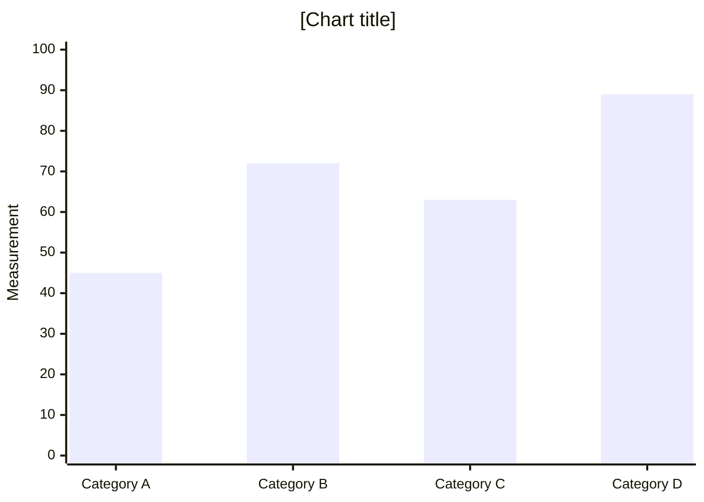

<!-- Source: https://github.com/SuperiorByteWorks-LLC/agent-project | License: Apache-2.0 | Author: Clayton Young / Superior Byte Works, LLC (Boreal Bytes) -->

# Research Paper / Technical Analysis Template

> **Back to [Markdown Style Guide](../markdown_style_guide.md)** — Read the style guide first for formatting, citation, and emoji rules.

**Use this template for:** Research papers, technical analyses, literature reviews, data-driven reports, competitive analyses, market research, or any document built around evidence and methodology. Designed for heavy citation, structured argumentation, and reproducible findings.

**Key features:** Abstract for quick assessment, methodology section for credibility, findings with supporting data/diagrams, rigorous footnote citations throughout, and a complete references section.

**Philosophy:** A great research document lets the reader evaluate your conclusions independently. Show your work. Cite your sources. Present counter-arguments. The reader should trust your findings because the evidence is right there — not because you said so.

---

## How to Use

1. Copy this file to your project
2. Replace all `[bracketed placeholders]` with your content
3. Adjust sections — not every paper needs every section, but the core flow (Abstract → Introduction → Methodology → Findings → Conclusion) should stay intact
4. **Cite aggressively** — every claim, every statistic, every external methodology reference gets a `[^N]` footnote
5. Add [Mermaid diagrams](../mermaid_style_guide.md) for any process, architecture, data flow, or comparison

---

## Template Structure

```
1. Abstract — What you did, what you found, why it matters (150-300 words)
2. 📋 Introduction — Problem statement, context, scope, research questions
3. 📚 Background — Prior work, literature review, industry context
4. 🔬 Methodology — How you did the research, data sources, approach
5. 📊 Findings — What you discovered, with evidence and diagrams
6. 💡 Analysis — What the findings mean, implications, limitations
7. 🎯 Conclusions — Summary, recommendations, future work
8. 🔗 References — All cited sources with full URLs
```

---

## The Template

Everything below the line is the template. Copy from here:

---

# [Paper Title: Descriptive and Specific]

_[Author(s) or Team] · [Organization] · [Date]_

---

## Abstract

[150–300 word summary structured as: **Context** (1–2 sentences on the problem space), **Objective** (what this paper investigates), **Method** (how the research was conducted), **Key findings** (the most important results), **Significance** (why this matters and who should care).]

**Keywords:** [keyword 1], [keyword 2], [keyword 3], [keyword 4], [keyword 5]

---

## 📋 Introduction

### Problem statement

[What problem exists? Why does it matter? Who is affected? Be specific — include metrics where available.]

[The scope of the problem, with citation][^1].

### Research questions

This paper investigates:

1. **[RQ1]** — [Specific, answerable question]
2. **[RQ2]** — [Specific, answerable question]
3. **[RQ3]** — [Specific, answerable question]

### Scope and boundaries

- **In scope:** [What this paper covers]
- **Out of scope:** [What this paper deliberately excludes and why]
- **Target audience:** [Who will benefit from these findings]

<details>
<summary><strong>💬 Context Notes</strong></summary>

- Why this research was initiated
- Organizational context or business driver
- Relationship to prior internal work
- Known constraints that shaped the scope

</details>

---

## 📚 Background

### Industry context

[Current state of the field. What's known. What the established approaches are. Cite existing work.]

[Key finding from prior research][^2]. [Another relevant study found][^3].

### Prior work

| Study / Source      | Key Finding       | Relevance to Our Work |
| ------------------- | ----------------- | --------------------- |
| [Author (Year)][^4] | [What they found] | [How it connects]     |
| [Author (Year)][^5] | [What they found] | [How it connects]     |
| [Author (Year)][^6] | [What they found] | [How it connects]     |

### Gap in current knowledge

[What's missing from existing research? What question remains unanswered? This is the gap your paper fills.]

<details>
<summary><strong>📋 Extended Literature Review</strong></summary>

[Deeper discussion of related work, historical context, evolution of approaches, and detailed comparison of methodologies used by prior researchers. This depth supports the paper's credibility without cluttering the main flow.]

</details>

---

## 🔬 Methodology

### Approach

[Describe your research methodology — qualitative, quantitative, mixed methods, experimental, observational, case study, etc.]

```mermaid
flowchart LR
    accTitle: Research Methodology Flow
    accDescr: Four-phase research process from data collection through analysis to validation and reporting

    collect[📥 Data **collection**] --> clean[⚙️ Data **cleaning**]
    clean --> analyze[🔍 **Analysis**]
    analyze --> validate[🧪 **Validation**]
    validate --> report[📤 Report **findings**]

    classDef process fill:#dbeafe,stroke:#2563eb,stroke-width:2px,color:#1e3a5f
    class collect,clean,analyze,validate,report process
```



### Data sources

| Source     | Type                             | Size / Scope              | Collection Period |
| ---------- | -------------------------------- | ------------------------- | ----------------- |
| [Source 1] | [Survey / API / Database / etc.] | [N records / respondents] | [Date range]      |
| [Source 2] | [Type]                           | [Size]                    | [Date range]      |

### Tools and technologies

- **[Tool 1]** — [Purpose and version]
- **[Tool 2]** — [Purpose and version]
- **[Analysis framework]** — [Why this was chosen]

### Limitations of methodology

> ⚠️ **Known limitations:** [Be upfront about what could affect the validity of your results — sample size, selection bias, time constraints, data quality issues. This builds credibility, not weakness.]

<details>
<summary><strong>🔧 Detailed Methodology</strong></summary>

### Data collection protocol

[Step-by-step description of how data was gathered]

### Cleaning and preprocessing

[What transformations were applied, what was excluded and why]

### Statistical methods

[Specific tests, confidence levels, software used]

### Reproducibility

[How someone else could replicate this research — data availability, code repositories, environment setup]

</details>

---

## 📊 Findings

### Finding 1: [Descriptive title]

[Present the finding clearly. Lead with the conclusion, then show the evidence.]

[Data supporting this finding][^7]:

| Metric     | Before  | After   | Change  |
| ---------- | ------- | ------- | ------- |
| [Metric 1] | [Value] | [Value] | [+/- %] |
| [Metric 2] | [Value] | [Value] | [+/- %] |

> 📌 **Key insight:** [One-sentence takeaway from this finding]

### Finding 2: [Descriptive title]

[Present the finding. Include a diagram if the finding involves relationships, processes, or comparisons.]



[Explanation of what the data shows and why it matters.]

### Finding 3: [Descriptive title]

[Present the finding with supporting evidence.]

<details>
<summary><strong>📊 Supporting Data Tables</strong></summary>

[Detailed data tables, raw numbers, statistical breakdowns that support the findings but would interrupt the reading flow if placed inline. Readers who want to verify can expand.]

</details>

---

## 💡 Analysis

### Interpretation

[What do the findings mean? Connect back to your research questions. Explain the "so what?"]

- **RQ1:** [How Finding 1 answers Research Question 1]
- **RQ2:** [How Finding 2 answers Research Question 2]
- **RQ3:** [How Finding 3 answers Research Question 3]

### Implications

**For [audience 1]:**

- [What this means for them and what action they should consider]

**For [audience 2]:**

- [What this means for them and what action they should consider]

### Comparison with prior work

[How do your findings compare with the studies referenced in the Background section? Do they confirm, contradict, or extend prior work?]

### Limitations

[What caveats should the reader keep in mind? What factors might affect generalizability? Be honest — this is where credibility is built.]

<details>
<summary><strong>💬 Discussion Notes</strong></summary>

- Alternative interpretations of the data
- Edge cases or outliers observed
- Areas where more data would strengthen conclusions
- Potential confounding variables

</details>

---

## 🎯 Conclusions

### Summary

[3–5 sentences. Restate the problem, summarize the key findings, and state the primary recommendation. A reader who skips to this section should understand the entire paper's value.]

### Recommendations

1. **[Recommendation 1]** — [Specific, actionable. What to do, who should do it, expected impact]
2. **[Recommendation 2]** — [Specific, actionable]
3. **[Recommendation 3]** — [Specific, actionable]

### Future work

- [Research direction 1] — [What it would investigate and why it matters]
- [Research direction 2] — [What it would investigate and why it matters]

---

## 🔗 References

_All sources cited in this paper:_

[^1]: [Author/Org]. ([Year]). "[Title]." _[Publication]_. <https://example.com>

[^2]: [Author/Org]. ([Year]). "[Title]." _[Publication]_. <https://example.com>

[^3]: [Author/Org]. ([Year]). "[Title]." _[Publication]_. <https://example.com>

[^4]: [Author/Org]. ([Year]). "[Title]." _[Publication]_. <https://example.com>

[^5]: [Author/Org]. ([Year]). "[Title]." _[Publication]_. <https://example.com>

[^6]: [Author/Org]. ([Year]). "[Title]." _[Publication]_. <https://example.com>

[^7]: [Author/Org]. ([Year]). "[Title]." _[Publication]_. <https://example.com>

---

_Last updated: [Date]_
