<!-- Source: https://github.com/SuperiorByteWorks-LLC/agent-project | License: Apache-2.0 | Author: Clayton Young / Superior Byte Works, LLC (Boreal Bytes) -->

# Block Diagram

> **Back to [Style Guide](../mermaid_style_guide.md)** — Read the style guide first for emoji, color, and accessibility rules.

**Syntax keyword:** `block-beta`
**Best for:** System block composition, layered architectures, component topology where spatial layout matters
**When NOT to use:** Process flows (use [Flowchart](flowchart.md)), infrastructure with cloud icons (use [Architecture](architecture.md))

> ⚠️ **Accessibility:** Block diagrams do **not** support `accTitle`/`accDescr`. Always place a descriptive _italic_ Markdown paragraph directly above the code block.

---

## Exemplar Diagram

_Block diagram showing a three-tier web application architecture from client-facing interfaces through application services to data storage, with emoji labels indicating component types:_

```mermaid
block-beta
    columns 3

    block:client:3
        columns 3
        browser["🌐 Browser"]
        mobile["📱 Mobile App"]
        cli["⌨️ CLI Tool"]
    end

    space:3

    block:app:3
        columns 3
        api["🖥️ API Server"]
        worker["⚙️ Worker"]
        cache["⚡ Redis Cache"]
    end

    space:3

    block:data:3
        columns 2
        db[("💾 PostgreSQL")]
        storage["📦 Object Storage"]
    end

    browser --> api
    mobile --> api
    cli --> api
    api --> worker
    api --> cache
    worker --> db
    api --> db
    worker --> storage
```

---

## Tips

- Use `columns N` to control the layout grid
- Use `space:N` for empty cells (alignment/spacing)
- Nest `block:name:span { ... }` for grouped sections
- Connect blocks with `-->` arrows
- Use **emoji in labels** `["🔧 Component"]` for visual distinction
- Use cylinder `("text")` syntax for databases within blocks
- Keep to **3–4 rows** with **3–4 columns** for readability
- **Always** pair with a Markdown text description above for screen readers

---

## Template

_Description of the system layers and how components connect:_

```mermaid
block-beta
    columns 3

    block:layer1:3
        columns 3
        comp_a["📋 Component A"]
        comp_b["⚙️ Component B"]
        comp_c["📦 Component C"]
    end

    space:3

    block:layer2:3
        columns 2
        comp_d["💾 Component D"]
        comp_e["🔧 Component E"]
    end

    comp_a --> comp_d
    comp_b --> comp_d
    comp_c --> comp_e
```

---

## Complex Example

_Enterprise platform architecture rendered as a 5-tier block diagram with 15 components. Each tier is a block group spanning the full width, with internal columns controlling component layout. Connections show the primary data flow paths between tiers:_

```mermaid
block-beta
    columns 4

    block:clients:4
        columns 4
        browser["🌐 Browser"]
        mobile["📱 Mobile App"]
        partner["🔌 Partner API"]
        admin["🔐 Admin Console"]
    end

    space:4

    block:gateway:4
        columns 2
        apigw["🌐 API **Gateway**"]
        auth["🔐 Auth Service"]
    end

    space:4

    block:services:4
        columns 4
        user_svc["👤 User Service"]
        order_svc["📋 Order Service"]
        product_svc["📦 Product Service"]
        notify_svc["📤 Notification Service"]
    end

    space:4

    block:data:4
        columns 3
        postgres[("💾 PostgreSQL")]
        redis["⚡ Redis Cache"]
        elastic["🔍 Elasticsearch"]
    end

    space:4

    block:infra:4
        columns 3
        mq["📥 Message Queue"]
        logs["📊 Log Aggregator"]
        metrics["📊 Metrics Store"]
    end

    browser --> apigw
    mobile --> apigw
    partner --> apigw
    admin --> auth
    apigw --> auth
    apigw --> user_svc
    apigw --> order_svc
    apigw --> product_svc
    order_svc --> notify_svc
    user_svc --> postgres
    order_svc --> postgres
    product_svc --> elastic
    order_svc --> redis
    notify_svc --> mq
    order_svc --> mq
    mq --> logs
```

### Why this works

- **5 tiers read top-to-bottom** like a network diagram — clients, gateway, services, data, infrastructure. Each tier is a block spanning the full width with its own column layout.
- **`space:4` creates visual separation** between tiers without unnecessary lines or borders, keeping the diagram clean and scannable.
- **Cylinder syntax `("text")` for databases** — PostgreSQL renders as a cylinder, instantly recognizable as a data store. Other components use standard rectangles.
- **Connections show real data paths** — not every possible connection, just the primary flows. A fully-connected diagram would be unreadable; this shows the key paths an engineer would trace during debugging.
