<!-- Source: https://github.com/SuperiorByteWorks-LLC/agent-project | License: Apache-2.0 | Author: Clayton Young / Superior Byte Works, LLC (Boreal Bytes) -->

# Gantt Chart

> **Back to [Style Guide](../mermaid_style_guide.md)** — Read the style guide first for emoji, color, and accessibility rules.

**Syntax keyword:** `gantt`
**Best for:** Project timelines, roadmaps, phase planning, milestone tracking, task dependencies
**When NOT to use:** Simple chronological events (use [Timeline](timeline.md)), process logic (use [Flowchart](flowchart.md))

---

## Exemplar Diagram

```mermaid
gantt
    accTitle: Q1 Product Launch Roadmap
    accDescr: Eight-week project timeline across discovery, design, build, and launch phases with milestones for design review and go/no-go decision

    title 🚀 Q1 Product Launch Roadmap
    dateFormat YYYY-MM-DD
    axisFormat %b %d

    section 📋 Discovery
        User research          :done, research, 2026-01-05, 7d
        Competitive analysis   :done, compete, 2026-01-05, 5d
        Requirements doc       :done, reqs, after compete, 3d

    section 🎨 Design
        Wireframes             :done, wire, after reqs, 5d
        Visual design          :active, visual, after wire, 7d
        🏁 Design review       :milestone, review, after visual, 0d

    section 🔧 Build
        Core features          :crit, core, after visual, 10d
        API integration        :api, after visual, 8d
        Testing                :test, after core, 5d

    section 🚀 Launch
        Staging deploy         :staging, after test, 3d
        🏁 Go / no-go          :milestone, decision, after staging, 0d
        Production release     :crit, release, after staging, 2d
```

---

## Tips

- Use `section` with emoji prefix to group by phase or team
- Mark milestones with `:milestone` and `0d` duration — prefix with 🏁
- Status tags: `:done`, `:active`, `:crit` (critical path, highlighted)
- Use `after taskId` for dependencies
- Keep total timeline **under 3 months** for readability
- Use `axisFormat` to control date display (`%b %d` = "Jan 05", `%m/%d` = "01/05")

---

## Template

```mermaid
gantt
    accTitle: Your Title Here
    accDescr: Describe the timeline scope and key milestones

    title 📋 Your Roadmap Title
    dateFormat YYYY-MM-DD
    axisFormat %b %d

    section 📋 Phase 1
        Task one       :done, t1, 2026-01-01, 5d
        Task two       :active, t2, after t1, 3d

    section 🔧 Phase 2
        Task three     :crit, t3, after t2, 7d
        🏁 Milestone   :milestone, m1, after t3, 0d
```

---

## Complex Example

A cross-team platform migration spanning 4 months with 6 sections, 24 tasks, and 3 milestones. Shows dependencies across teams (backend migration blocks frontend migration), critical path items, and the full lifecycle from planning through launch monitoring.

```mermaid
gantt
    accTitle: Multi-Team Platform Migration Roadmap
    accDescr: Four-month migration project across planning, backend, frontend, data, QA, and launch teams with cross-team dependencies, critical path items, and three milestone gates

    title 🚀 Platform Migration — Q1/Q2 2026
    dateFormat YYYY-MM-DD
    axisFormat %b %d

    section 📋 Planning
        Kickoff meeting               :done, plan1, 2026-01-05, 2d
        Architecture review            :done, plan2, after plan1, 5d
        Migration plan document        :done, plan3, after plan2, 5d
        Risk assessment                :done, plan4, after plan2, 3d
        🏁 Planning complete           :milestone, m_plan, after plan3, 0d

    section 🔧 Backend Team
        API redesign                   :crit, be1, after m_plan, 12d
        Data migration scripts         :be2, after m_plan, 10d
        New service deployment         :crit, be3, after be1, 8d
        Backward compatibility layer   :be4, after be1, 6d

    section 🎨 Frontend Team
        Component library update       :fe1, after m_plan, 10d
        Page migration                 :crit, fe2, after be3, 12d
        A/B testing setup              :fe3, after fe2, 5d
        Feature parity validation      :fe4, after fe2, 4d

    section 🗄️ Data Team
        Schema migration               :crit, de1, after be2, 8d
        ETL pipeline update            :de2, after de1, 7d
        Data validation suite          :de3, after de2, 5d
        Rollback scripts               :de4, after de1, 4d

    section 🧪 QA Team
        Test plan creation             :qa1, after m_plan, 7d
        Regression suite               :qa2, after be3, 10d
        Performance testing            :crit, qa3, after qa2, 7d
        UAT coordination               :qa4, after qa3, 5d
        🏁 QA sign-off                 :milestone, m_qa, after qa4, 0d

    section 🚀 Launch
        Staging deploy                 :crit, l1, after m_qa, 3d
        🏁 Go / no-go decision         :milestone, m_go, after l1, 0d
        Production cutover             :crit, l2, after m_go, 2d
        Post-launch monitoring         :l3, after l2, 10d
        Legacy system decommission     :l4, after l3, 5d
```

### Why this works

- **6 sections map to real teams** — each team sees their workstream at a glance. Cross-team dependencies (frontend waits for backend API, QA waits for backend deploy) are explicit via `after taskId`.
- **`:crit` marks the critical path** — the chain of tasks that determines the total project duration. If any critical task slips, the launch date moves. Mermaid highlights these in red.
- **3 milestones are decision gates** — Planning Complete, QA Sign-off, and Go/No-Go. These are the points where stakeholders make decisions, not just status updates.
- **24 tasks across 4 months** is readable because sections group by team. Without sections, this would be an unreadable wall of bars.
