<!-- Source: https://github.com/SuperiorByteWorks-LLC/agent-project | License: Apache-2.0 | Author: Clayton Young / Superior Byte Works, LLC (Boreal Bytes) -->

# Kanban Board

> **Back to [Style Guide](../mermaid_style_guide.md)** — Read the style guide first for emoji, color, and accessibility rules.

**Syntax keyword:** `kanban`
**Best for:** Task status boards, workflow columns, work-in-progress visualization, sprint status
**When NOT to use:** Task timelines/dependencies (use [Gantt](gantt.md)), process logic (use [Flowchart](flowchart.md))

> ⚠️ **Accessibility:** Kanban boards do **not** support `accTitle`/`accDescr`. Always place a descriptive _italic_ Markdown paragraph directly above the code block.

---

## Exemplar Diagram

_Kanban board showing the current sprint's work items distributed across four workflow columns, with emoji indicating column status:_

```mermaid
kanban
Backlog
  task1[🔐 Upgrade auth library]
  task2[🛡️ Add rate limiting]
  task3[📚 Write API docs]
In Progress
  task4[📊 Build dashboard]
  task5[🐛 Fix login bug]
In Review
  task6[💰 Refactor payments]
Done
  task7[📊 Deploy monitoring]
  task8[⚙️ Update CI pipeline]
```

> ⚠️ **Tip:** Each task gets ONE domain emoji at the start — this is your primary visual signal for categorization. Column emoji indicates workflow state.

---

## Tips

- Name columns with **status emoji** for instant visual scanning
- Add **domain emoji** to tasks for quick categorization
- Keep to **3–5 columns**
- Limit to **3–4 items per column** (representative, not exhaustive)
- Items are simple text descriptions — keep concise
- Good for sprint snapshots in documentation
- **Always** pair with a Markdown text description above for screen readers

---

## Template

_Description of the workflow columns and what the board represents. Always show all 6 columns:_

```mermaid
kanban
Backlog
  task1[🔧 Task description]
  task2[📝 Task description]
In Progress
  task3[⚙️ Task description]
In Review
  task4[👀 Task description]
Done
  task5[🚀 Task description]
Blocked
  task6[⛔ Task description]
Won't Do
  task7[❌ Task description]
```

> ⚠️ Always include all 6 columns — Backlog, In Progress, In Review, Done, Blocked, Won't Do. Even if a column is empty, include a placeholder item like [No items yet] to make the structure explicit.

---

## Complex Example

_Sprint W07 board for the Payments Team showing a realistic distribution of work items across all six columns, including blocked items:_

```mermaid
kanban
Backlog
  b1[📊 Add pool monitoring to auth]
  b2[🔍 Evaluate PgBouncer]
  b3[📝 Update runbook for pool alerts]
In Progress
  ip1[📊 Build merchant dashboard MVP]
  ip2[📚 Write v2 API migration guide]
  ip3[🔐 Add OAuth2 PKCE flow]
In Review
  r1[🛡️ Request validation middleware]
Done
  d1[🛡️ Rate limiting on /v2/charges]
  d2[🐛 Fix pool exhaustion errors]
  d3[📊 Pool utilization alerts]
Blocked
  bl1[🔄 Auth service pool config]
Won't Do
  w1[❌ Mobile SDK in this sprint]
```

Tips for complex kanban diagrams:

- Add a Blocked column to surface stalled work — this is the highest-signal column on any board
- Keep items to 3–4 per column max even in complex boards — the diagram is a summary, not an exhaustive list
- Use the same emoji per domain across columns for visual tracking (📊 = dashboards, 🛡️ = security, 🐛 = bugs)
- Always show all 6 columns — use placeholder items like [No items] when a column is empty
