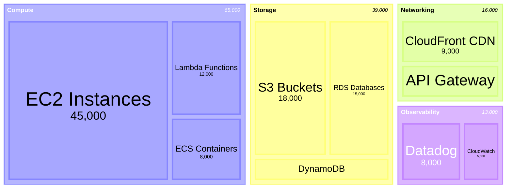
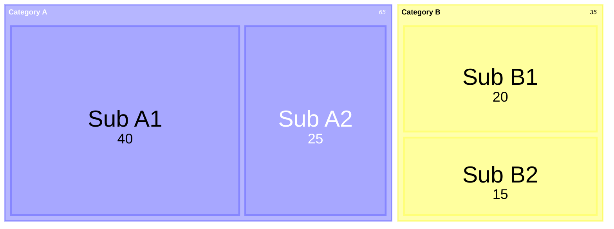

<!-- Source: https://github.com/SuperiorByteWorks-LLC/agent-project | License: Apache-2.0 | Author: Clayton Young / Superior Byte Works, LLC (Boreal Bytes) -->

# Treemap Diagram

> **Back to [Style Guide](../mermaid_style_guide.md)** — Read the style guide first for emoji, color, and accessibility rules.

**Syntax keyword:** `treemap-beta`
**Mermaid version:** v11.12.0+
**Best for:** Hierarchical data proportions, budget breakdowns, disk usage, portfolio composition
**When NOT to use:** Simple flat proportions (use [Pie](pie.md)), flow-based hierarchy (use [Sankey](sankey.md))

> ⚠️ **Accessibility:** Treemap diagrams do **not** support `accTitle`/`accDescr`. Always place a descriptive _italic_ Markdown paragraph directly above the code block.
>
> ⚠️ **GitHub support:** Treemap is very new — verify it renders on your target GitHub version before using.

---

## Exemplar Diagram

_Treemap showing annual cloud infrastructure costs broken down by service category and specific service, with rectangle sizes proportional to spend:_

---

## Tips

- Parent nodes (sections) use quoted text: `"Section Name"`
- Leaf nodes add a value: `"Leaf Name": 123`
- Hierarchy is created by **indentation** (spaces or tabs)
- Values determine the size of each rectangle — larger value = larger area
- Keep to **2–3 levels** of nesting for clarity
- Use `classDef` and `:::class` syntax for styling nodes
- **Always** pair with a Markdown text description above for screen readers

---

## Template

_Description of the hierarchical data and what the proportions represent:_

