<!-- Source: https://github.com/SuperiorByteWorks-LLC/agent-project | License: Apache-2.0 | Author: Clayton Young / Superior Byte Works, LLC (Boreal Bytes) -->

# User Journey

> **Back to [Style Guide](../mermaid_style_guide.md)** — Read the style guide first for emoji, color, and accessibility rules.

**Syntax keyword:** `journey`
**Best for:** User experience mapping, customer journey, process satisfaction scoring, onboarding flows
**When NOT to use:** Simple processes without satisfaction data (use [Flowchart](flowchart.md)), chronological events (use [Timeline](timeline.md))

---

## Exemplar Diagram

```mermaid
journey
    accTitle: New Developer Onboarding Experience
    accDescr: Journey map tracking a new developer through day-one setup, first-week integration, and month-one productivity with satisfaction scores at each step

    title 👤 New Developer Onboarding
    section 📋 Day 1 Setup
        Read onboarding doc       : 3 : New Dev
        Clone repositories        : 4 : New Dev
        Configure local env       : 2 : New Dev
        Run into setup issues     : 1 : New Dev
    section 🤝 Week 1 Integration
        Meet the team             : 5 : New Dev
        Pair program on first PR  : 4 : New Dev, Mentor
        Navigate codebase         : 2 : New Dev
        First PR merged           : 5 : New Dev
    section 🚀 Month 1 Productivity
        Own a small feature       : 4 : New Dev
        Participate in code review: 4 : New Dev
        Ship to production        : 5 : New Dev
```

---

## Tips

- Scores: **1** = 😤 frustrated, **3** = 😐 neutral, **5** = 😄 delighted
- Assign actors after the score: `5 : Actor1, Actor2`
- Use `section` with **emoji prefix** to group by time period or phase
- Focus on **pain points** (low scores) — that's where the insight is
- Keep to **3–4 sections** with **3–4 steps** each

---

## Template

```mermaid
journey
    accTitle: Your Title Here
    accDescr: Describe the user journey and what experience insights it reveals

    title 👤 Journey Title
    section 📋 Phase 1
        Step one           : 3 : Actor
        Step two           : 4 : Actor
    section 🔧 Phase 2
        Step three         : 2 : Actor
        Step four          : 5 : Actor
```

---

## Complex Example

A multi-persona e-commerce journey comparing a New Customer vs Returning Customer across 5 phases. The two actors experience the same flow with different satisfaction scores, revealing exactly where first-time UX needs investment.

```mermaid
journey
    accTitle: E-Commerce Customer Journey Comparison
    accDescr: Side-by-side journey map comparing new customer and returning customer satisfaction across discovery, shopping, checkout, fulfillment, and post-purchase phases to identify first-time experience gaps

    title 👤 E-Commerce Customer Journey Comparison
    section 🔍 Discovery
        Find the product         : 3 : New Customer, Returning Customer
        Read reviews             : 4 : New Customer, Returning Customer
        Compare alternatives     : 3 : New Customer
        Go to saved favorite     : 5 : Returning Customer
    section 🛒 Shopping
        Add to cart              : 4 : New Customer, Returning Customer
        Apply coupon code        : 2 : New Customer
        Use stored coupon        : 5 : Returning Customer
        Choose shipping option   : 3 : New Customer, Returning Customer
    section 💰 Checkout
        Enter payment details    : 2 : New Customer
        Use saved payment        : 5 : Returning Customer
        Review and confirm       : 4 : New Customer, Returning Customer
        Receive confirmation     : 5 : New Customer, Returning Customer
    section 📦 Fulfillment
        Track shipment           : 3 : New Customer, Returning Customer
        Receive delivery         : 5 : New Customer, Returning Customer
        Unbox product            : 5 : New Customer, Returning Customer
    section 🔄 Post-Purchase
        Leave a review           : 2 : New Customer
        Contact support          : 1 : New Customer
        Reorder same item        : 5 : Returning Customer
        Recommend to friend      : 3 : Returning Customer
```

### Why this works

- **Two personas on the same map** — instead of two separate diagrams, both actors appear in each step. The satisfaction gap between New Customer (2-3) and Returning Customer (4-5) is immediately visible in checkout and post-purchase.
- **5 sections follow the real funnel** — discovery → shopping → checkout → fulfillment → post-purchase. Each section tells a story about where the experience breaks down for new users.
- **Some steps are persona-specific** — "Compare alternatives" is only New Customer, "Reorder same item" is only Returning Customer. This shows divergent paths within the shared journey.
- **Low scores are the actionable insight** — New Customer scores 1-2 on payment entry, coupon application, and support contact. These are the specific UX investments that would improve conversion.
