<!-- Source: https://github.com/SuperiorByteWorks-LLC/agent-project | License: Apache-2.0 | Author: Clayton Young / Superior Byte Works, LLC (Boreal Bytes) -->

# Decision Record (ADR/RFC) Template

> **Back to [Markdown Style Guide](../markdown_style_guide.md)** — Read the style guide first for formatting, citation, and emoji rules.

**Use this template for:** Architecture Decision Records (ADRs), Requests for Comment (RFCs), technical design documents, or any decision that needs to be documented with its context, options considered, and rationale. Designed so that future teams understand not just _what_ was decided, but _why_ — and can evaluate whether the decision still holds.

**Key features:** Structured options comparison with explicit tradeoffs, decision matrix, consequences section that captures both benefits and risks, and status tracking for the decision lifecycle.

**Philosophy:** Decisions rot faster than code. Six months from now, someone will ask "why did we do it this way?" If the answer is "nobody remembers," the decision is as good as random. This template makes the reasoning permanent, searchable, and evaluable. It also forces the author to genuinely consider alternatives — if you can't articulate why you rejected Option B, you haven't done enough analysis.

---

## How to Use

1. Copy this file to your project's `docs/decisions/` or `adr/` directory
2. Name it sequentially: `001-use-postgresql-over-mongodb.md`
3. Replace all `[bracketed placeholders]` with your content
4. **Present options honestly** — don't set up straw men just to knock them down
5. Add [Mermaid diagrams](../mermaid_style_guide.md) for architecture comparisons, data flow changes, or migration paths

---

## The Template

Everything below the line is the template. Copy from here:

---

# [ADR-NNN]: [Decision Title — Clear and Specific]

| Field               | Value                                                      |
| ------------------- | ---------------------------------------------------------- |
| **Status**          | [Proposed / Accepted / Deprecated / Superseded by ADR-NNN] |
| **Date**            | [YYYY-MM-DD]                                               |
| **Decision makers** | [Names or roles]                                           |
| **Consulted**       | [Who was asked for input]                                  |
| **Informed**        | [Who needs to know the outcome]                            |

---

## 📋 Context

### What prompted this decision?

[Describe the situation that requires a decision. What changed? What problem emerged? What opportunity appeared? Be specific — include metrics, incidents, or user feedback that triggered this.]

### Current state

[How things work today. What architecture, tool, or process is currently in place. Include a diagram if it helps.]

```mermaid
flowchart LR
    accTitle: Current State Architecture
    accDescr: How the system works today before this decision is implemented

    a[⚙️ Current component] --> b[💾 Current dependency]
    b --> c[📤 Current output]
```

### Constraints

- **[Constraint 1]:** [Budget, timeline, team size, compliance requirement, etc.]
- **[Constraint 2]:** [Technical constraint, backward compatibility, SLA, etc.]
- **[Constraint 3]:** [Organizational constraint, vendor lock-in, skills gap, etc.]

### Requirements

This decision must:

- [ ] [Requirement 1 — specific and measurable]
- [ ] [Requirement 2]
- [ ] [Requirement 3]

---

## 🔍 Options Considered

### Option A: [Name]

**Description:** [What this option entails — 2–3 sentences]

**Pros:**

- [Specific benefit with evidence if available]
- [Another benefit]

**Cons:**

- [Specific drawback with impact assessment]
- [Another drawback]

**Estimated effort:** [T-shirt size or days/weeks]
**Estimated cost:** [If relevant — licensing, infrastructure, personnel]

### Option B: [Name]

**Description:** [What this option entails]

**Pros:**

- [Benefit]
- [Benefit]

**Cons:**

- [Drawback]
- [Drawback]

**Estimated effort:** [Estimate]
**Estimated cost:** [If relevant]

### Option C: [Name] _(if applicable)_

**Description:** [What this option entails]

**Pros:**

- [Benefit]

**Cons:**

- [Drawback]

**Estimated effort:** [Estimate]

### Decision matrix

| Criterion                               | Weight         | Option A            | Option B | Option C |
| --------------------------------------- | -------------- | ------------------- | -------- | -------- |
| [Criterion 1 — e.g., Performance]       | [High/Med/Low] | [Score or ✅/⚠️/❌] | [Score]  | [Score]  |
| [Criterion 2 — e.g., Team expertise]    | [Weight]       | [Score]             | [Score]  | [Score]  |
| [Criterion 3 — e.g., Migration effort]  | [Weight]       | [Score]             | [Score]  | [Score]  |
| [Criterion 4 — e.g., Long-term cost]    | [Weight]       | [Score]             | [Score]  | [Score]  |
| [Criterion 5 — e.g., Community/support] | [Weight]       | [Score]             | [Score]  | [Score]  |

---

## 🎯 Decision

**We chose Option [X]: [Name].**

[2–3 sentences explaining the core rationale. What tipped the decision? Which criteria mattered most and why?]

### Why not the others?

- **Option [Y] was rejected because:** [Specific reason — not "it wasn't good enough" but "the migration effort would take 3 sprints and delay the Q2 launch"]
- **Option [Z] was rejected because:** [Specific reason]

---

## ⚡ Consequences

### Positive

- [Benefit 1 — what improves, with expected impact]
- [Benefit 2]

### Negative

- [Tradeoff 1 — what we lose or what becomes harder]
- [Tradeoff 2]

### Risks

| Risk     | Likelihood     | Impact         | Mitigation            |
| -------- | -------------- | -------------- | --------------------- |
| [Risk 1] | [Low/Med/High] | [Low/Med/High] | [How we'll handle it] |
| [Risk 2] | [Likelihood]   | [Impact]       | [Mitigation]          |

### Implementation impact

```mermaid
flowchart LR
    accTitle: Post-Decision Architecture
    accDescr: How the system will work after this decision is implemented

    a[⚙️ New component] --> b[💾 New dependency]
    b --> c[📤 New output]
```

---

## 📋 Implementation plan

| Step     | Owner         | Target date | Status                             |
| -------- | ------------- | ----------- | ---------------------------------- |
| [Step 1] | [Person/Team] | [Date]      | [Not started / In progress / Done] |
| [Step 2] | [Person/Team] | [Date]      | [Status]                           |
| [Step 3] | [Person/Team] | [Date]      | [Status]                           |

---

## 🔗 References

- [Related ADR or RFC](../adr/ADR-001-agent-optimized-documentation-system.md)
- [External documentation or benchmark](https://example.com)
- [Relevant issue or discussion thread](../../docs/project/issues/issue-00000001-agentic-documentation-system.md)

---

## Review log

| Date   | Reviewer | Outcome                                   |
| ------ | -------- | ----------------------------------------- |
| [Date] | [Name]   | [Proposed / Approved / Requested changes] |

---

_Last updated: [Date]_
