<!-- Source: https://github.com/SuperiorByteWorks-LLC/agent-project | License: Apache-2.0 | Author: Clayton Young / Superior Byte Works, LLC (Boreal Bytes) -->

# How-To / Tutorial Guide Template

> **Back to [Markdown Style Guide](../markdown_style_guide.md)** — Read the style guide first for formatting, citation, and emoji rules.

**Use this template for:** Step-by-step tutorials, how-to guides, onboarding walkthroughs, runbooks, setup instructions, or any document whose primary job is teaching someone to do something. Designed so the reader succeeds on the first attempt.

**Key features:** Prerequisites with verification commands, numbered steps with expected output at each stage, "verify it works" checkpoints, troubleshooting section for common failures, and "what's next" pathways.

**Philosophy:** A how-to guide fails if the reader gets stuck. Every step should be verifiable — the reader should be able to confirm they did it right before moving to the next one. Anticipate the exact moment they'll wonder "did that work?" and put a checkpoint there. Include the error messages they'll actually see, not just the happy path.

---

## How to Use

1. Copy this file to your project
2. Replace all `[bracketed placeholders]` with your content
3. **Test the guide yourself from scratch** — follow every step on a clean machine. If you skip this, the guide has bugs.
4. Add [Mermaid diagrams](../mermaid_style_guide.md) for process overviews, decision points, or architecture context
5. Include actual output (trimmed) at every verification step — don't just say "you should see output"

---

## The Template

Everything below the line is the template. Copy from here:

---

# [How to: Specific Task Description]

_[Estimated time: N minutes] · [Difficulty: Beginner / Intermediate / Advanced] · [Last verified: Date]_

---

## 📋 Overview

### What you'll accomplish

[One paragraph: what the reader will have built, configured, or achieved by the end of this guide. Be concrete.]

### What you'll learn

- [Skill or concept 1]
- [Skill or concept 2]
- [Skill or concept 3]

### Process overview

```mermaid
flowchart LR
    accTitle: Tutorial Process Overview
    accDescr: High-level steps from prerequisites through setup, configuration, and verification

    prereqs([📋 Prerequisites]) --> setup[🔧 Setup]
    setup --> configure[⚙️ Configure]
    configure --> build[📦 Build]
    build --> verify[✅ Verify]

    classDef done fill:#dcfce7,stroke:#16a34a,stroke-width:2px,color:#14532d
    class verify done
```



---

## 📋 Prerequisites

Before starting, ensure you have:

| Requirement      | Version     | Verify with           | Install link                         |
| ---------------- | ----------- | --------------------- | ------------------------------------ |
| [Tool/Runtime]   | ≥ [version] | `[command] --version` | [Install guide](https://example.com) |
| [Dependency]     | ≥ [version] | `[command] --version` | [Install guide](https://example.com) |
| [Account/Access] | —           | [How to verify]       | [Sign up](https://example.com)       |

**Verify all prerequisites:**

```bash
# Run each command — all should succeed before proceeding
[command1] --version    # Expected: [version] or higher
[command2] --version    # Expected: [version] or higher
```

> ⚠️ **Don't skip this.** Step 3 will fail if [specific prerequisite] isn't installed correctly.

---

## 🔧 Steps

### Step 1: [Action verb — Set up / Create / Configure / Install]

[Brief context: why this step is necessary — one sentence.]

```bash
[command to run]
```

**Expected output:**

```
[What the terminal should show — include actual output, trimmed if long]
```

> 💡 **Tip:** [Helpful context about this step — common variation, what to do if on a different OS, etc.]

---

### Step 2: [Action verb]

[Brief context.]

```bash
[command to run]
```

**Expected output:**

```
[What you should see]
```

**If you see an error here**, check:

- [Most common cause and fix]
- [Second most common cause and fix]

---

### Step 3: [Action verb]

[Brief context.]

[If this step involves editing a file, show the exact content:]

```yaml
# config/[filename]
[key]: [value]
[key]: [value]

# [Comment explaining what this section does]
[key]:
  [nested_key]: [value]
  [nested_key]: [value]
```

> 📌 **Important:** [Critical detail about this configuration — what breaks if you get it wrong]

---

### Step 4: [Action verb]

[Brief context.]

```bash
[command to run]
```

**Expected output:**

```
[What you should see]
```

---

### Step 5: [Action verb — this should be the final action]

[Brief context.]

```bash
[final command]
```

---

## ✅ Verify it works

Run through these checks to confirm everything is working:

| Check     | Command     | Expected result           |
| --------- | ----------- | ------------------------- |
| [Check 1] | `[command]` | [What success looks like] |
| [Check 2] | `[command]` | [What success looks like] |
| [Check 3] | `[command]` | [What success looks like] |

**All checks pass?** You're done. Jump to [What's next](#-whats-next).

**Something failed?** See [Troubleshooting](#-troubleshooting) below.

---

## 🔧 Troubleshooting

### "[Exact error message the reader will see]"

**Cause:** [What triggers this error — be specific]

**Fix:**

```bash
[exact commands to resolve]
```

**Verify the fix:**

```bash
[command to confirm the error is resolved]
```

---

### "[Another common error message]"

**Cause:** [What triggers this]

**Fix:**

1. [Step 1]
2. [Step 2]
3. Re-run the step that failed

---

### "[Third common issue — might not be an error message but a symptom]"

**Cause:** [What causes this behavior]

**Fix:**

[Solution with commands]

---

### Still stuck?

- **Search existing issues:** [docs/project/issues/](../../docs/project/issues/)
- **Ask for help:** [docs/project/kanban/](../../docs/project/kanban/)
- **File a bug:** [issue template](../../docs/project/issues/issue-00000001-agentic-documentation-system.md)

---

## 🚀 What's next

Now that you've completed this guide:

- **[Next tutorial]** — [What it covers and why you'd want to do it next](../workflow_guide.md)
- **[Reference docs]** — [Where to learn the full feature set](../markdown_style_guide.md)
- **[Advanced topic]** — [Deeper dive for when you're ready](../operational_readiness.md)

<details>
<summary><strong>📋 Quick reference card</strong></summary>

Key commands and values from this guide for future reference:

| Action         | Command     |
| -------------- | ----------- |
| [Start]        | `[command]` |
| [Stop]         | `[command]` |
| [Check status] | `[command]` |
| [View logs]    | `[command]` |
| [Reset]        | `[command]` |

</details>

---

## 🔗 References

- [Official documentation](https://example.com) — [Which section is most relevant]
- [Source repository](https://github.com/SuperiorByteWorks-LLC) — [For bug reports and contributions]

---

_Last verified: [Date] on [OS/Platform version] · Maintained by [Team/Author]_
